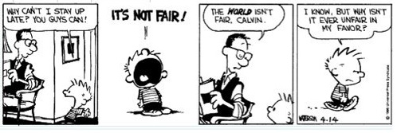
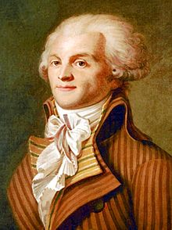
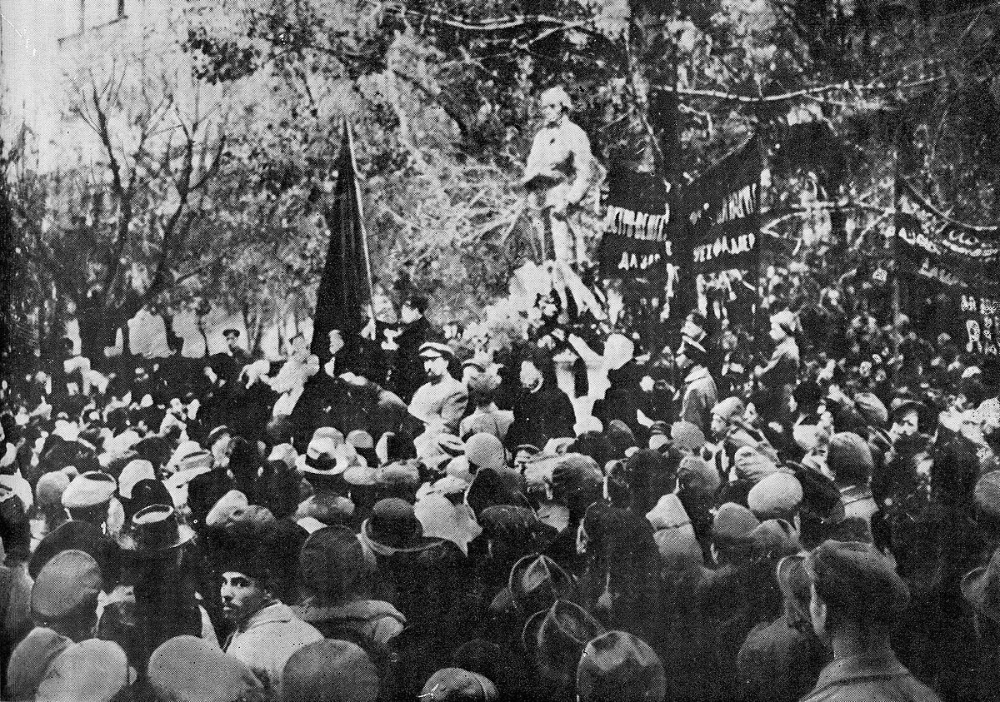
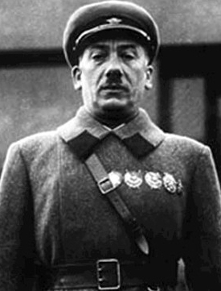
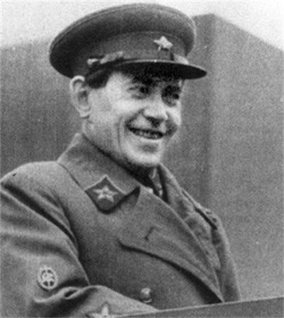

Introducción al Derecho liberal
===

---

Jan Krepelka

Universidad de Verano Instituto Juan de Mariana, Lanzarote, Julio 2018

---

## Plan

1. El problema: la voluntad de derechos asimétricos
2. Derechos asimétricos son nihilismo
3. La solución: el Derecho
4. Los enemigos del Derecho
5. Conclusión: la importancia del Derecho

---

## 1. El problema: la voluntad de derecho asimétrico

---

### 1.1. Calvin y Hobbes

¿porque el mundo no es injusto en mi favor?

---

¡porsupuesto, no para mi!

---

### 1.2. Robespierre

Maximilien de Robespierre (1758-1794)

---Texto---

Robespierre, uno de los lideres de la Revolucion frances, especialmente durante la Teror, guillotinando a miles de personas.

Robespierre introduzco en la ley frances el concepto de "enemigo del pueblo". Pero quienes son los enemigos del pueblo? es decir, quien lo decide? por supuesto, para Robespierre los enemigos del pueblo son sus enemigos, es un instrumento de poder, de derecho asimétrico... pero como acabo? La definicion era por supuesto muy mal definida, y las pruevas neceserias lijeras.

Y como acabo? guillotinado en plaza de la Revolución.

---

## 1.3. La troika de la NKVD

---Texto---

Robespierre ha sido una inspiración para los comunistas rusos mas de un siglo despues: [una estatue en el honor de Robespierre](https://en.wikipedia.org/wiki/Robespierre_Monument) fue uno de los primeros monumentos ordenados por Lenin, que lo consideraba como un precursor del comunismo.

Los comunistas soviéticos también tenían comités arbitrarios, las troikas, y también llamaban "enemigos del pueblo" a los que querían eliminar, y tambien tenian leyes mal definidas, arbitrarias, grande poder a las troikas, pocos derechos a los acusados.

La policía política de Stalin, la [NKVD](https://es.wikipedia.org/wiki/NKVD), ha tenido tres jefes :

---

|Генрих Ягода|||
|---|---|---|
||||
|[Guénrij Yagoda](https://es.wikipedia.org/wiki/Gu%C3%A9nrij_Yagoda)|Nikolái Yezhov|[Lavrenti Beria](https://es.wikipedia.org/wiki/Lavrenti_Beria)|
|(1934-1936)|(1936-1938)|(1938-1953)|

---Texto---

Tienen dos cosas en común:

la primera, todos han sido criminales ordenando detenciones y ejecuciones arbitrarias, con falsas acusaciones, y confesiones obtenidos con torturas.

la segunda, todos han acabado de la misma menara: acusados falsamente, detenidos y ejecutados arbitrariamente, con confesiones obtenidos con torturas

> Fue encerrado en la lóbrega prisión especial del NKVD de Sujánovka, reservada a «enemigos del pueblo especialmente peligrosos», situada a las afueras de Moscú. Allí fue acusado de espionaje en favor de Alemania, Gran Bretaña, Polonia y Japón; de dirigir una confabulación en el seno del NKVD, de preparar un golpe de Estado, organizar algunos asesinatos y de sodomía. Incapaz de soportar la tortura a la que se le sometió, aceptó todas las acusaciones.

https://es.wikipedia.org/wiki/Nikol%C3%A1i_Yezhov#Cambio_de_sistema:_las_troikas_de_las_.C2.ABoperaciones_nacionales.C2.BB

Fue encerrado en la lóbrega85​ prisión especial del NKVD de Sujánovka, reservada a «enemigos del pueblo especialmente peligrosos», situada a las afueras de Moscú.85​ Allí fue acusado de espionaje en favor de Alemania, Gran Bretaña, Polonia y Japón; de dirigir una confabulación en el seno del NKVD, de preparar un golpe de Estado, organizar algunos asesinatos y de sodomía.86​ Incapaz de soportar la tortura a la que se le sometió, aceptó todas las acusaciones.86​

https://es.wikipedia.org/wiki/Nikol%C3%A1i_Yezhov#Cambio_de_sistema:_las_troikas_de_las_.C2.ABoperaciones_nacionales.C2.BB

y tambien, todos acabaron exactamente de la misma menera. y tambien no eran los unicos,

---

## 2. El derecho asimétrico es nihilismo

### 2.1. El concepto robado

Que fueron pensando estas personas los momentos antes de morir? Les había parecido justa su condenación?

pero con cuales principios la podrian rechazar?

---

<video data-autoplay src="nihilists-not-fair.mp4"></video>

---Texto---

vamos a ver [un extracto de la película *Big Lebowski*](nihilists-not-fair.mp4).

---

eso es una illustracion de lo que Ayn Rand llamaba el sofismo del concepto robado: los nihilistas rechazan el concepto de justicia, hasta el momento que les interasa a ellos. pero ya es tarde.

### 2.2. Autoridad divina

> Convencidos éstos de que los gobernantes tienen su autoridad recibida de Dios, se sentirán obligados en justicia a aceptar con docilidad los mandatos de los gobernantes y a prestarles obediencia y fidelidad, con un sentimiento parecido a la piedad que los hijos tienen con sus padres. «Todos habéis de estar sometidos a las autoridades superiores»[3]. Despreciar el poder legítimo, sea el que sea el titular del poder, es tan ilícito como resistir a la voluntad de Dios. Quienes resisten a la voluntad divina se despeñan voluntariamente en el abismo de su propia perdición. «Quien resiste a la autoridad resiste a la disposición de Dios, y los que la resisten se atraen sobre sí la condenación»[4].
>
> -- [Carta Encíclica Immortale Dei Del Sumo Pontífice León XIII Sobre La Constitución Cristiana Del Estado](http://w2.vatican.va/content/leo-xiii/es/encyclicals/documents/hf_l-xiii_enc_01111885_immortale-dei.html)

y no es solo el catolicismo, el protestantismo tambien:

+ Martin Luther idem !

El problema con esta tesis, por supuesto, es *quien* tiene "su autoridad recibida de Dios"? Y al final si hay conflicto y el rey esta remplazado por otro rey, el también tendrá su autoridad de Dios! (Históricamente: dinastías cambiadas, reconocimientos por el Vatican ?? y quien ha sido el primero?

Al final es lo mismo que todo argumento de pueblo o raza superior, o cualquier casta superior con derecho a mandar: si otra logra a superar la, es que obviamente no era tan superior. Al final, es una declaración del derecho del mas fuerte, que al final es puramente descriptivo: las cosas son come son.

Vamos a ver otro extracto de película, la de *El hombre que quiso ser rey*:

englishmen.mp4

Al final, nadie de los proponientes de algún derecho asimétrico ha jamas llevado la prueba de porque el hecho de ser ingles, o blanco, o miembro del comité revolucionario, o cualquier otro pretexto, seria justificación para tener derechos distintos. Son nada mas que pretextos de algunos nihilistas para tomar poder sobre otras personas, nada mas.

Sean Connery sangre

Todos somos seres humanos con misma sangre, con misma existencia física, sometidos a las mismas leyes de lógica, y así con los mismos derechos, así que nadie tiene derecho de ser rey (o presidente, o dictador), por la razón que nadie tiene derecho que otro no tendría.

## 3. La solución: el Derecho

### 3.1 Simetría del derecho

Y eso nos lleva a la posición liberal. El liberalismo, en ese sentido, no es nada mas que la teoría mas avanzada de la ciencia del Derecho. El liberalismo es un grupo de soluciones a varios problemas jurídicos, pero lo mas importante es el marco. El derecho que se puede justificar de manera puramente lógica, y que asi es incontestable para cualquier persona que sí acepta el Derecho, es decir, cualquier persona que rechaza los problemas del nihilismo que acabamos de ver.

....

### identidad de los derechos de cada ser humano

asdf

>Sostenemos como evidentes estas verdades: que los hombres son creados iguales; que son dotados por su Creador de ciertos derechos inalienables; que entre estos están la vida, la libertad y la búsqueda de la felicidad.
>
> -- [Declaración de Independencia de los Estados Unidos](https://es.wikisource.org/wiki/Declaración_de_Independencia_de_los_Estados_Unidos_de_América), 1776

a

> Los hombres nacen y permanecen libres e iguales en derechos. 
>
> -- [Declaración de los Derechos del Hombre y del Ciudadano](http://www.conseil-constitutionnel.fr/conseil-constitutionnel/root/bank_mm/espagnol/es_ddhc.pdf), 1789

a

> Las mujeres son seres humanos, y por lo tanto tienen los mismos derechos naturales que todo ser humano puede tener. 
>
> -- [Lysander Spooner, 1877](http://www.enemigosdelestado.com/contra-sufragio-femenino-spooner-lysander/)

### si, en serio.

Convenio para la Protección
de los Derechos Humanos
y de las Libertades Fundamentales

http://www.echr.coe.int/Documents/Convention_SPA.pdf

ARTÍCULO 4
Prohibición de la esclavitud y del trabajo forzado
1. Nadie podrá ser sometido a esclavitud o servidumbre.
2. Nadie podrá ser constreñido a realizar un trabajo forzado u
obligatorio.
3. No se considera como „trabajo forzado u obligatorio“ en el
sentido del presente artículo:
a) todo trabajo exigido normalmente a una persona
privada de libertad en las condiciones previstas por
el artículo 5 del presente Convenio, o durante su libertad
condicional ;
b) todo servicio de carácter militar o, en el caso de objetores de
conciencia en los países en que la objeción de conciencia
sea reconocida como legítima, cualquier otro servicio
sustitutivo del servicio militar obligatorio;
c) todo servicio exigido cuando alguna emergencia o
calamidad amenacen la vida o el bienestar de la comunidad;
d) todo trabajo o servicio que forme parte de las obligaciones
cívicas normales.

es como decir, vamos a prohibir el Gulag, pero al exception del campamiento numero trentayocho, que no vamos a llamar Gulag.

Y lo mismo lo vemos ya en la La Declaración Universal de Derechos Humanos (Naciones Unidas, 1948), que prohibe la esclavitud, y promete mismos derechos a todos, incluso "Artículo 2.
 
Toda persona tiene todos los derechos y libertades proclamados en esta Declaración, sin distinción alguna de raza, color, sexo, idioma, religión, opinión política o de cualquier otra índole, origen nacional o social, posición económica, nacimiento o cualquier otra condición. "

pero todos los paises que tienen servicio militar obligatorio *para los varones* no les molesta? Hmm...

Las mujeres son seres humanos, y por lo tanto tienen los mismos derechos naturales que todo ser humano puede tener. Tienen tanto derecho a hacer leyes como lo tienen los hombres; Y ESTO QUIERE DECIR QUE NO TIENEN DERECHO ALGUNO. Ningún ser humano, ni ningún grupo de seres humanos, tienen derecho a hacer leyes, y obligar a otros seres humanos a obedecerlas. Decir que tienen este derecho es decir que ellos son dueños y amos de aquellos a quienes requieren obediencia.

La única ley que cualquier ser humano puede legítimamente ser obligado a obedecer es simplemente la ley de la justicia. Y la justicia no es una cosa que se pueda hacer, o deshacer, o alterar, por ninguna autoridad humana. Se trata de un principio natural, inherente a la naturaleza misma del hombre y de las cosas. Es ese principio natural que determina lo que es mío y lo que es tuyo, lo que es el derecho o propiedad de uno y lo que es el derecho o propiedad de otro. Es, por así decirlo, la línea que la Naturaleza ha establecido entre los derechos y propiedad de un hombre, y los derechos y propiedad de otro hombre.

Este principio natural, que llamamos justicia, y que asignamos a cada ser humano, es, repito, no una cosa que se ha hecho, sino un tema de la ciencia que hay que entender, como las matemáticas, la química o la geología. Y todas las leyes, así llamadas, que los hombres han hecho nunca, ya sea para crear, definir, o controlar los derechos de las personas, son intrínsecamente tan absurdas y ridículas como lo sería crear leyes para definir o controlar las matemáticas, la química, o la geología.

### universalizmo

> En una edad más culturalmente confiada, a los británicos en La India se les planteó la práctica del "sutí" -- la tradición de quemar a las viudas en las piras funerarias de sus maridos. El General Sir Charles Napier fue impecablemente multicultural:
>
> "Ustedes dicen que quemar a las viudas es su costumbre. Muy bien. Nosotros también tenemos una costumbre: cuando los hombres queman viva a una mujer, atamos una soga alrededor de sus cuellos y los ahorcamos. Construyan su pira funeraria. Detrás de ella, mis carpinteros construirán unas horcas. Ustedes pueden seguir su costumbre. Y después nosotros seguiremos las nuestras".
>
> -- [Mark Steyn](https://books.google.es/books?id=thP_UKhPbP0C&pg=PA193&lpg=PA193&dq=%22General+Sir+Charles+Napier%22+%22my+carpenters+will+build+a+gallows.%22&source=bl&ots=k-xwQ6v5z8&sig=38ge9XwtlbctCiVMJeuYpJgi_tQ&hl=en&sa=X&ved=0ahUKEwjO1ePlxqLVAhUBLMAKHYcYCg8Q6AEIMjAD#v=onepage&q&f=false) [ [traducción](http://blogs.periodistadigital.com/tizas.php/2006/04/15/una-cultura-y-un-rebano-de-dementes) ]

## categorías equivocadas

Liberpedia/Droit

los con cabello y los sin

http://fr.liberpedia.org/Chauve

http://fr.liberpedia.org/Droit

## el sombrero magico

Nosotros liberales somos los ateistas del sombrero magico.

## simetria 1

ostracismo

## simetria 2

legalizar es prohibir

[camiseta: legalize everything]

## Hoppe: no se puede rechazar el Derecho

declaracion de los derechos humanos (revolucion francesa, onu, independencia americana)
derechos humanos

Grotius
Schopenhauer

Escuela de Salamanca

Cicero

https://es.wikipedia.org/wiki/Derecho_natural

https://es.wikipedia.org/wiki/Escuela_de_Salamanca#Derecho_natural_y_derechos_humanos

https://www.juandemariana.org/ijm-actualidad/analisis-diario/francisco-de-vitoria-y-la-justicia-universal

https://www.wikiberal.org/wiki/%C3%89cole_de_Salamanque#Droit_naturel_et_droits_humains

http://www.uca.edu.ar/esp/sec-fderecho/subs-leynatural/esp/docs-congresos/2-jornada/ponencias/rizzo.pdf

https://es.wikipedia.org/wiki/Gabriel_V%C3%A1zquez

> Los individuos tienen derechos, y esos derechos son independientes de la autoridad social, quien no les puede tocar sin hacerse culpable de usurpación.
>
> -- Benjamin Constant, *[Sobre los derechos individuales](http://fr.liberpedia.org/Des_droits_individuels)*, 1818

## 4. Los enemigos del Derecho

## 4.1. Criticos del Derecho

> En su ultimo estadio, el comunismo no constituye una victoria del derecho socialista, sino una victoria del socialismo sobre el proprio Derecho.
>
> -- [Пётр Иванович Стучка](https://fr.wikipedia.org/wiki/P%C4%93teris_Stu%C4%8Dka), presidente del Tribunal Suprema de la Rusia soviética, [Энциклопедия государства и права, Vol. 3, 1927, p. 1593](http://136.243.13.116:88/Viewer.html?file=/Book/pdf/119204.pdf&embedded=true#page=797&zoom=90,-144,677).

> А буржуазное мировоззрение в право поставившее закон на место бога, как раз заключается в обожествлении фетишизации закона.
> -- [Пётр Иванович Стучка](https://fr.wikipedia.org/wiki/P%C4%93teris_Stu%C4%8Dka), président du Tribunal Suprême de la Russie soviétique, [Энциклопедия государства и права, Vol. 3, 1927, p. 424](http://136.243.13.116:88/Viewer.html?file=/Book/pdf/119204.pdf&embedded=true#page=212&zoom=130,-22,842).

> [L’idéologie bourgeoise du Droit a remplacé Dieu par la loi, déifiant ainsi son fétichisme du Droit.]

https://www.marxists.org/espanol/m-e/1870s/gotha/gotha.htm#i

Por eso, el derecho igual sigue siendo aquí, en principio, el derecho burgués, aunque ahora el principio y la práctica ya no se tiran de los pelos, mientras que en el regimen de intercambio de mercancias, el intercambio de equivalentes no se da más que como término medio, y no en los casos individuales.

A pesar de este progreso, este derecho igual sigue llevando implícita una limitación burguesa. El derecho de los productores es proporcional al trabajo que han rendido; la igualdad, aquí, consiste en que se mide por el mismo rasero: por el trabajo.

Pero unos individuos son superiores, fisica e intelectualmente a otros y rinden, pues, en el mismo tiempo, más trabajo, o pueden trabajar más tiempo; y el trabajo, para servir de medida, tiene que determinarse en cuanto a duración o intensidad; de otro modo, deja de ser una medida. Este derecho igual es un derecho desigual para trabajo desigual. No reconoce ninguna distinción de clase, porque aquí cada individuo no es más que un trabajador como los demás; pero reconoce, tacitamente, como otros tantos privilegios naturales, las desiguales aptitudes individuales****, y, por consiguiente, la desigual capacidad de rendimiento. En el fondo es, por tanto, como todo derecho, el derecho de la desigualdad. El derecho sólo puede consistir, por naturaleza, en la aplicación de una medida igual; pero los individuos desiguales (y no serían distintos individuos si no fuesen desiguales) sólo pueden medirse por la misma medida siempre y cuando que se les coloque bajo un mismo punto de vista y se les mire solamente en un aspecto determinado ; por ejemplo, en el caso dado, sólo en cuanto obreros, y no se vea en ellos ninguna otra cosa, es decir, se prescinda de todo lo demás. Prosigamos: un obrero está casado y otro no; uno tiene más hijos que otro, etc., etc. A igual trabajo y, por consiguiente, a igual participación en el fondo social de consumo, uno obtiene de hecho más que otro, uno es más rico que otro, etc. Para evitar todos estos inconvenientes, el derecho no tendría que ser igual, sino desigual.

Pero estos defectos son inevitables en la primera fase de la sociedad comunista, tal y como brota de la sociedad capitalista después de un largo y doloroso alumbramiento. El derecho no puede ser nunca superior a la estructura económica ni al desarrollo cultural de la sociedad por ella condicionado.

En una fase superior de la sociedad comunista, cuando haya desaparecido la subordinación esclavizadora de los individuos a la división del trabajo, y con ella, el contraste entre el trabajo intelectual y el trabajo manual; cuando el trabajo no sea solamente un medio de vida, sino la primera necesidad vital; cuando, con el desarrollo de los individuos en todos sus aspectos, crezcan también las fuerzas productivas y corran a chorro lleno los manantiales de la riqueza colectiva, sólo entonces podrá rebasarse totalmente el estrecho horizonte del derecho burgués y la sociedad podrá escribir en sus banderas: ¡De cada cual, según sus capacidades; a cada cual según sus necesidades!

Marx: bourgeois

## 4.2. Criticos de los derechos humanos

## 4.3. Falsos derechos (positivos)

## 4.4 Falsas igualdades

trampa falsas igualdades ( loving vs virginia )

## 4.4. Dignidad humana

> Todos los seres humanos nacen libres e iguales en dignidad y derechos y, dotados como están de razón y conciencia, deben comportarse fraternalmente los unos con los otros.

http://www.un.org/es/universal-declaration-human-rights/ La Declaración Universal de Derechos Humanos (Naciones Unidas, 1948)

## 4.5. Collectivismo

> For liberalism, the individual is the end and society the means; nor is it conceivable that the indivual, considered in the dignity of an ultimate finality, be lowered to mere instrumentality.
> For Fascism, society is the end, individuals the means, and its whole life consists in using individuals as instruments for its social ends.
>
> Alfredo Rocco, from 1925 to 1932 he was Minister of Justice of fascist Italy, The Political Doctrine of Fascism, 1925

## 4.6. Derecho vs poder

def. poder ;-)

Power is having the discretion and the means to asymmetrically enforce one’s will over others.
[Le pouvoir consiste à détenir la discrétion et les moyens d'imposer asymétriquement sa volonté sur les autres.]
Interpersonal Power: A Review, Critique, and Research Agenda

https://serval.unil.ch/resource/serval:BIB_1F6C29A616C0.P001/REF

---

## 5. Conclusión

---Texto---

Al final, los enemigos del derecho, que se declaran así, o que buscan pretextos, o que se declaran nihilistas, quieren lo mismo : sus propios derechos protegidos, y el poder de hacer lo que quieran con las vidas de los demas.

Por supuesto, este no puede funcionar jamas. Que esto llega a una sociedad totalitaria, o a una sociedad anomistica, el problemas es lo mismo: la absencia de seguridad juridica. El caos es lo mismo. Los primitivistas y los tecnocratas ambos se oponen al derecho.

La alternativa es Derecho, si o no. Es decir, por un lado, un Derecho universal, para todas las personas, en todas partes, que ofrece seguridad, prosperidad, etc, y al otro lado el caos, los asesinatos (que sean organizados por estados o no impedidan por estados), la pobreza (que sea llegad deliberamente por decision del estado, o por su destruccion de derechos de propriedad).

Al final, todos son nihilistas que quieren el poder, es decir, que critican al Derecho porque quieren derecho de hacer lo que quieran.

Son nihilistas malhonestas, nada mas.

Sin liberalismo, hay desorden, hay anomia, es la ley del mas fuerte, es la guerra de todos contra todos.

El Derecho liberal es el unico marco que ofrece una sociedad civilizada, pacifica, donde la proteccion de los derechos de cada uno incluye la responsabilidad de no atentar a los derechos de los demas.

Historicamente, todo el progreso que hemos tenido ha sido posible gracias al grado de respeto parcial de los derechos de propriedad. Con mas respecto aun, ya seriamos sido libres de hacer muchissimo mas (tema de mi proxima charla)

---

¡Muchas gracias!
