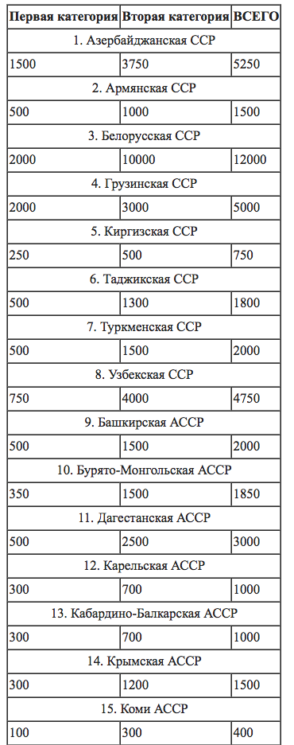
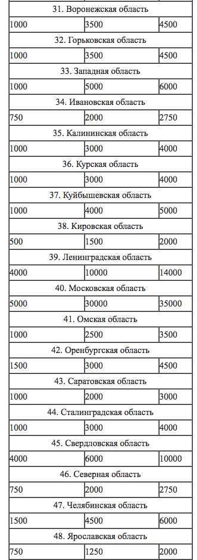

El Derecho y sus enemigos
===

---Texto---

---

Jan Krepelka

Universidad de Verano, Instituto Juan de Mariana, Lanzarote, Julio 2019

---

## Plan

1. Historia del Derecho
2. Enemigos del Derecho
3. Futuro del Derecho

---

1.5 Anarquismo

---

"For law in our use of the term here means nothing else than what is just, and that, too, rather in a negative than in an affirmative sense, that being lawful which is not unjust."

Nam just hic nihil aliud quand quod justum est significat, idque negante magis sensu quam aiente, ut jus sit quod injustum non est.

" It is necessary to understand, further, that the law of nature deals not only with things which are outside the domain of the human will, but with many things also which result from an act of the human will. Thus ownership, such as now obtains, was introduced by the will of man; but, once introduced, the law of nature points out that it is wrong for me, against your will, to take away that which is subject to your ownership. "

Sciendum prætera, jus naturale non de iis tantum agere quæ voluntatem humanam existunt, sed de multis etiam quæ voluntatis humanæe actum consequuntur. Sic dominium, quale nunc in usu est, voluntas humana introduxit: at eo introducto nefas mihi esse id arripere te invito quod tui est dominii, ipsum indicat jus naturale; quare furtum naturali jure prohibitum.

"The law of nature, again, is unchangeable – even in the sense that it cannot be changed by God. Measureless as is the power of God, nevertheless it can be said that there are certain things over which that power does not extend; for things of which this is said are spoken only, having no sense corresponding with reality and being mutually contradictory. Just as even God, then, cannot cause that two times two should not make four, so He cannot cause that which is intrinsically evil be not evil."

Est autem jus naturale adeo immutabile, ut ne a Deo quidem mutari queat. Quanquam enim immensa est Dei potentia, dici tamen quædam possunt, ad quæ se illa non extendi; quia quæ ita dicuntur, dicuntur tantum, sensum autem qui rem exprimat nullum habent, sed sibi ipsis repugntant. Sicut ergo ut bis duo non sint quatuor ne a Deo quidem potest effici, ita ne hoc quidem, ut quod intrinseca ratione malum est, malum non sit.

Now that is unjust which is in conflict with the nature of society of beings endowed with reason.

Est autem injustum, quod naturæ societatis ratione utentium repugnat.

Est injuste, ce qui est en contradiction avec la nature d'une société d'êtres rationnels.

https://archive.org/details/huggrotiidejure00grongoog
https://lonang.com/library/reference/grotius-law-war-and-peace/gro-101/

estamos ya en anarquia, solo que algunas personas olvidan de contar los crimenes del estado en las estatisticas

https://www.panarchy.org/spooner/law.html

+ porque el partido socialista no deveria existir (hacer trad ??)

in efecto, el socialismo es una lucha de todos contra todos para las subvenciones, para quel nivel de "colectivad" va a tomar las decisiones, es decir, cuales individuos con cual pretexto van a tomar las decisiones en vez de los que sí tienen derecho de tomarlas (los proprietarios) ?

(precisamente el concepto de "enemigo de los trabajadores" враг народа, враг трудящихся)

En fait je crois que la confusion est entre "la nature de l'homme (raison) fait qu'il peut découvrir le Droit" (s'il a envie, alors que généralement les (autres) animaux en sont incapables) et "la nature de l'homme (raison) fait qu'il doit respecter le Droit" (c'est à dire tous les hommes, rien que les hommes, partout et et toutes circomstances)

chez Grotius ça me semble plus subtil/correct :

Est autem injustum, quod naturæ societatis ratione utentium repugnat.

"Now that is unjust which is in conflict with the nature of society of beings endowed with reason. " (Grotius)

c'est toute ma thèse ici http://laissez-faire.ch/fr/articles/de-l-impossibilite-du-non-liberalisme/ , l'argument de Hoppe ("argumentation ethics"), etc : si on pratique la raison, alors le Droit est inévitable (somme seul moyen logique d'organiser une société non-nihiliste, dans un monde physique de rareté où le conflit est donc possible)

Et quiconque se met en dehors du Droit (choisit la violence), se comporte ipso facto comme bête sauvage (comme dirait Faré) et ne pourra pas s'étonner d'être traité comme tel. (On peut prendre l'exemple de Soral qui choisit la violence lors d'un débat : il se place dès lors dans la catégorie racaille, animaux sauvages, et il ne sert strictement plus à rien d'avoir la moindre discussion avec lui, il n'y a plus rien à en tirer)

à noter que la belle formulation de Grotius (si ma compréhension du latin et/ou la traduction anglaise sont corrects), ne parle pas de nature de l'homme, mais de société rationnelle :-) autrement dit, c'est pas forcément tous les hommes, ni forcément que des hommes (Grotius, précurseur du Droit transhumaniste :-) )

Autrement dit, la raison fait qu'on peut découvrir le Droit, mais ça reste un choix (pour preuve le fait que certains se placent délibèrement en dehors), et si certains veulent vivre en tribu nihiliste comme des bêtes dans la jungle, eh bien grand bien leur fasse. Il n'y a pas d'incohérence ou de trahison par rapport une prétendue "nature de l'homme".

La seule incohérence (le problème central d'ailleurs https://pansay.github.io/zp/slides/derecho-liberal/ ) c'est le sophisme d'auto-exemption, ceux qui veulent du Droit mais quand ça les arrange. Mais ça n'a rien à voir avec une quelconque nature intrinsèque, c'est simplement des actions, des choix, qui sont contradictoires, et observables en tant que tels (sans devoir aller chercher plus loin dans la métaphysique)

D'où mon accusation de circulaire contre Rand et Rothbard qui y voient une sorte d'impératif cosmique consubstantiel à la "nature" de "l'homme" : si c'était tellement dans la "nature de l'homme" de respecter le Droit, alors tous le respecteraient et la question ne se poserait pas.

Toute cette réflexion repose notamment sur l’idée d’une nature de l’homme. L’homme a une nature qu’Aristote définit comme sociable. L’homme est un animal politique. C’est aussi un être raisonnable, intelligent, capable de discernement et puis d’autre part c’est un être spirituel. C’est d’ailleurs cette qualité d’être spirituel qui assure le libre-arbitre de cet homme, capable de choisir entre le bien et le mal, le vrai et le faux, le juste et l’injuste. Le respect de cette nature humaine exige le respect « d’une loi véritable » ou « droite raison », que « l’homme ne peut méconnaître sans se renier » (Cicéron). Ce que Cicéron appelle « droite raison » fait écho à ce qu’Aristote appelait « justice naturelle ».

Tiens je relis la théorie du Droit naturel de Rothbard dans Ethics of Liberty, ça me convainc pas plus que la première fois. C'est très randien en fait, tourné sur la "nature de l'homme" et tout ce délire (raisonnement confus et circulaire selon moi).

Alors qu'en fait c'est beaucoup plus simple :

http://laissez-faire.ch/fr/articles/de-l-impossibilite-du-non-liberalisme/

http://www.propertyrightsmatter.com/square-one-liberty-through-property/

2.x derecho vs reification :

no hay autoridad oficial

all quiet western front

===

individualismo

|||querer|llorar|llover|decidir|

piedra
nube
persona
Estado

Grotius
Schopenhauer
Spooner
Salamanca
Hoppe

etc

2.1 socialismo

etc.

Hoppe, principio de non agression

### 3.5 categorías equivocadas

Liberpedia/Droit

los con cabello y los sin

http://fr.liberpedia.org/Chauve

http://fr.liberpedia.org/Droit

## simetria 1

ostracismo

## simetria 2

---

legalizar es prohibir

|||
|---|---|
|||

---

|||
|---|---|
|||

---

## Hoppe: no se puede rechazar el Derecho

Grotius
Schopenhauer

Escuela de Salamanca

Cicero

https://es.wikipedia.org/wiki/Derecho_natural

https://es.wikipedia.org/wiki/Escuela_de_Salamanca#Derecho_natural_y_derechos_humanos

https://www.juandemariana.org/ijm-actualidad/analisis-diario/francisco-de-vitoria-y-la-justicia-universal

https://www.wikiberal.org/wiki/%C3%89cole_de_Salamanque#Droit_naturel_et_droits_humains

http://www.uca.edu.ar/esp/sec-fderecho/subs-leynatural/esp/docs-congresos/2-jornada/ponencias/rizzo.pdf

https://es.wikipedia.org/wiki/Gabriel_V%C3%A1zquez

> в его последней стадии коммунизм представлятся не как победа социалистического права, а как победа социализма над правом вообще.

---

> La ideología burguesa del Derecho ha tomado el puesto de Dios, deificando así su fetiche del Derecho.
>
> -- [Пётр Иванович Стучка](https://fr.wikipedia.org/wiki/P%C4%93teris_Stu%C4%8Dka), presidente del Tribunal Suprema de la Rusia soviética, [Энциклопедия государства и права, Vol. 3, 1927, p. 424](http://136.243.13.116:88/Viewer.html?file=/Book/pdf/119204.pdf&embedded=true#page=212&zoom=130,-22,842).

---Texto---

> А буржуазное мировоззрение в право поставившее закон на место бога, как раз заключается в обожествлении фетишизации закона.

Las personas que eran condenadas pero no a muerte eran condenadas a 10 años en el Gulag. Gulag es un acrónimo ruso, en el cual el "lag" significa "lager", que es la palabra alemán (la misma que en los campos de concentración Nacionalsocialistas) prestada al ruso. En Cecho, idioma de un país que ha conocido y campos de concentración Nacionalsocialistas y los socialistas, la misma palabra se usa para ambos.

Pero ni siquiera en los "Lageres" las personas eran aseguradas de vivir:

(en ese periodo, se estima que el cuarto de los prisioneros moría por hambre, maltratamientos, durante el trasporte, etc. Pero ademas,)

Miramos las cuotas oficiales del orden de Yezhov:

---

||||
|---|---|---|
||||

---Texto---

Esos son las cifras para varias regiones de la Unión soviética ([wikipedia](https://ru.wikisource.org/wiki/Приказ_НКВД_от_30.07.1937_№_00447#II._.D0.9E_.D0.9C.D0.95.D0.A0.D0.90.D0.A5_.D0.9D.D0.90.D0.9A.D0.90.D0.97.D0.90.D0.9D.D0.98.D0.AF_.D0.A0.D0.95.D0.9F.D0.A0.D0.95.D0.A1.D0.A1.D0.98.D0.A0.D0.A3.D0.95.D0.9C.D0.AB.D0.9C_.D0.98_.D0.9A.D0.9E.D0.9B.D0.98.D0.A7.D0.95.D0.A1.D0.A2.D0.92.D0.95_.D0.9F.D0.9E.D0.94.D0.9B.D0.95.D0.96.D0.90.D0.A9.D0.98.D0.A5_.D0.A0.D0.95.D0.9F.D0.A0.D0.95.D0.A1.D0.A1.D0.98.D0.98.))

Cada linea es una región. La primera columna es la primera categoría de enemigos del pueblo, los "mas peligrosos", destinados a ejecución por fusilamiento. La segunda son la segunda categoría, las cifras de personas que hay que condenar solo a 10 años en el Gulag.

---

|||
|---|---|
|||

---Texto---

Mirad la ultima linea: alguien me puede decir ¿porque falta un numero?

...

pues esa ultima linea no es una región en el sentido común, pero sí es una en el sentido de Солженицын: es el archipiélago del Gulag: "Лагеря НКВД". son las cuotas de personas ya trabajando hasta la muerto en en frío, ya condenadas, pero que todavía había que matar.

##. x. 5 Nunca mas.

lo que ocuro despues de esos masacros de Stalin... Хрущёв, charla culto de la personalidad, 4 horas...

pero historiaco polaco Kołakowski muy buena pregunta: como ha sido posible ?

y eso es la pregunta interesante para el derecho:

http://laissez-faire.ch/fr/articles/plus-jamais-ca/

que sistema podemos establecer para que eso no puedo jamas acontecer ? y por supuesto es la pregunta que nunca contestan los socialistes cuando hablan de las "errores regretables" del comunismo

porque no han sido estos los trabajos de Hitler y Stalin ?

---

<video data-autoplay src="media/family-guy-hitler.mp4"></video>

---

---

eso es la pregunta que ningun socialista contesta.

y mas alla:
http://linguistica.rocks/dash-in-russian/

que sistema de Derecho para que la humanidad puede sobrevivir, sin Gulag, sin guerras, sin armas nucleares
?

+ => derecho a las armas : nadie fue armado en el Gulag !

[ basically do trans. new part 2 here]

http://linguistica.rocks/dash-in-russian/

gulag etc, then

en la Cechoslovacia socialista, el regimen donde yo he nacido, los prisoneros politoc los mandan tambien en encampaminentos de concentracion, especialmente los situados cerca de las minas de uranium, para trabajar en las mismas minas... sin proteccion. el uranium fue diractemente enviado a la union sovietico, para contribuier en ese gran proyecto progresista de annihilicaion nuclear de la humanidad.

y tambien esa destruccion del derecho fue teorizada:

respecto a todo eso

## 4.1. Criticos del Derecho

## 4.2. Criticos de los derechos humanos

## 4.3. Falsos derechos (positivos)

## 4.4 Falsas igualdades

trampa falsas igualdades ( loving vs virginia )

## 4.4. Dignidad humana

> Todos los seres humanos nacen libres e iguales en dignidad y derechos y, dotados como están de razón y conciencia, deben comportarse fraternalmente los unos con los otros.

http://www.un.org/es/universal-declaration-human-rights/ La Declaración Universal de Derechos Humanos (Naciones Unidas, 1948)

## 4.5. Collectivismo

> For liberalism, the individual is the end and society the means; nor is it conceivable that the indivual, considered in the dignity of an ultimate finality, be lowered to mere instrumentality.
> For Fascism, society is the end, individuals the means, and its whole life consists in using individuals as instruments for its social ends.
>
> Alfredo Rocco, from 1925 to 1932 he was Minister of Justice of fascist Italy, The Political Doctrine of Fascism, 1925

---

## 4.6. Derecho vs poder

def. poder ;-)

Power is having the discretion and the means to asymmetrically enforce one’s will over others.
[Le pouvoir consiste à détenir la discrétion et les moyens d'imposer asymétriquement sa volonté sur les autres.]
Interpersonal Power: A Review, Critique, and Research Agenda

https://serval.unil.ch/resource/serval:BIB_1F6C29A616C0.P001/REF

---

<video data-autoplay src="media/unlimited-power.mp4"></video>

---

> Las mujeres son seres humanos, y por lo tanto tienen los mismos derechos naturales que todo ser humano puede tener. Tienen tanto derecho a hacer leyes como lo tienen los hombres; Y ESTO QUIERE DECIR QUE NO TIENEN DERECHO ALGUNO. Ningún ser humano, ni ningún grupo de seres humanos, tienen derecho a hacer leyes, y obligar a otros seres humanos a obedecerlas. Decir que tienen este derecho es decir que ellos son dueños y amos de aquellos a quienes requieren obediencia.

> La única ley que cualquier ser humano puede legítimamente ser obligado a obedecer es simplemente la ley de la justicia. Y la justicia no es una cosa que se pueda hacer, o deshacer, o alterar, por ninguna autoridad humana. Se trata de un principio natural, inherente a la naturaleza misma del hombre y de las cosas. Es ese principio natural que determina lo que es mío y lo que es tuyo, lo que es el derecho o propiedad de uno y lo que es el derecho o propiedad de otro. Es, por así decirlo, la línea que la Naturaleza ha establecido entre los derechos y propiedad de un hombre, y los derechos y propiedad de otro hombre.

> Este principio natural, que llamamos justicia, y que asignamos a cada ser humano, es, repito, no una cosa que se ha hecho, sino un tema de la ciencia que hay que entender, como las matemáticas, la química o la geología. Y todas las leyes, así llamadas, que los hombres han hecho nunca, ya sea para crear, definir, o controlar los derechos de las personas, son intrínsecamente tan absurdas y ridículas como lo sería crear leyes para definir o controlar las matemáticas, la química, o la geología.

Y lo mismo lo vemos ya en la La Declaración Universal de Derechos Humanos (Naciones Unidas, 1948), que prohíbe la esclavitud, y promete mismos derechos a todos, incluso esto:

---

> Artículo 2.
>
> Toda persona tiene todos los derechos y libertades proclamados en esta Declaración, sin distinción alguna de raza, color, sexo, idioma, religión, opinión política o de cualquier otra índole, origen nacional o social, posición económica, nacimiento o cualquier otra condición.

---Texto---

pero todos los países que tienen servicio militar obligatorio *para los varones* no les molesta? Hmm...

conclusion

el futuro del Derecho -> transhumanismo

un hombre solo en la tierrra tendria libertad absoluta y respecto absoluto de sus derechos

"The State is God's Will." Hegel

https://en.wikipedia.org/wiki/Leszek_Ko%C5%82akowski

He came to the conclusion that the totalitarian cruelty of Stalinism was not an aberration, but instead a logical end-product of Marxism, whose genealogy he examined in his monumental Main Currents of Marxism, his major work, published in 1976–1978.

https://en.wikipedia.org/wiki/On_the_Cult_of_Personality_and_Its_Consequences

> En el XX Congreso del Partido Comunista de la Unión Soviética, celebrado en febrero de 1956, Jruschov pronunció su famosa confe- rencia sobre el «culto de la personalidad». Esta se celebró en sesión cerrada, pero en presencia de delegados extranjeros; la conferencia no fue editada nunca en la Unión Soviética, pero su texto fue divul- gado por algunos activistas del Partido y se publicó poco después por el Departamento de Estado de los BE. UU. (Entre los países co- munistas, Polonia parece haber sido el único en el que se distríbuy6 el texto impreso «para uso interno» de los miembros del Partido que gozaban de confianza; los partidos comunistas occidentales se nega- ron durante un tiempo JI. reconocer su autenticidad.) En él, Jruschov daba una descripci ón detallada de los crímenes y delirios paranoicos de Stalin, torturas, persecuciones y asesinatos de responsables del Par- tido, pero no rehabilitaba a los miembros de los movimientos de opo- sición: las víctimas cuyos nombres citaba eran estalinistas irrepro- chables como Postyshev, Gamarnik y Rudzutnk, y no los anteriores oponentes del dictador tales como Bujarin y Kamenev. Tampoco intentó Jruschov un análisis histórico y sociológico del sistema estalinista. Stalin había sido simplemente un criminal y un maníaco, responsable personalmente de todas las derrotas y desgracias del país. En cuanto a cómo, y en qué condiciones sociales, un paranoico sangriento pudo ejercer un poder despótico ilimitado sobre un país de doscientos millones de habitantes, que durante esta época había sido bendecido como el sistema más progresivo de gobierno que había conocido la his- toria humana, a este enigma la conferencia de jruschov no ofrecía respuesta alguna. Pero lo cierto era que el sistema soviético y el propio Partido habían permanecido impecablemente puros y no tenían responsabilidad alguna por las atrocidades del tirano.

> -- Leszek Kołakowski, Las principales corrientes del marxismo, pp. 435-436.

http://laissez-faire.ch/fr/articles/plus-jamais-ca/

Ne pas les prendre, c’est mettre en place un système anti-politique qui les rend impossibles.

Martin Latsis, chief of the Ukrainian Cheka, stated in the newspaper Red Terror:
Do not look in the file of incriminating evidence to see whether or not the accused rose up against the Soviets with arms or words. Ask him instead to which class he belongs, what is his background, his education, his profession. These are the questions that will determine the fate of the accused. That is the meaning and essence of the Red Terror.
— Martin Latsis, Red Terror[8]
The bitter struggle was described succinctly from the Bolshevik point of view by Grigory Zinoviev in mid-September 1918:
To overcome our enemies we must have our own socialist militarism. We must carry along with us 90 million out of the 100 million of Soviet Russia's population. As for the rest, we have nothing to say to them. They must be annihilated.
— Grigory Zinoviev, 1918[9]

+ https://en.wikipedia.org/wiki/Nikolai_Krylenko

Krylenko was an exponent of socialist legality and the theory that political considerations, rather than criminal guilt or innocence, should guide the application of punishment. Although a participant in the Show Trials and political repression of the late 1920s and early 1930s, Krylenko was ultimately arrested himself during the Great Purge. Following interrogation and torture by the NKVD, Krylenko confessed to extensive involvement in wrecking and anti-Soviet agitation. He was sentenced to death by the Military Collegium of the Soviet Supreme Court, in a trial lasting 20 minutes, and executed immediately afterwards.

