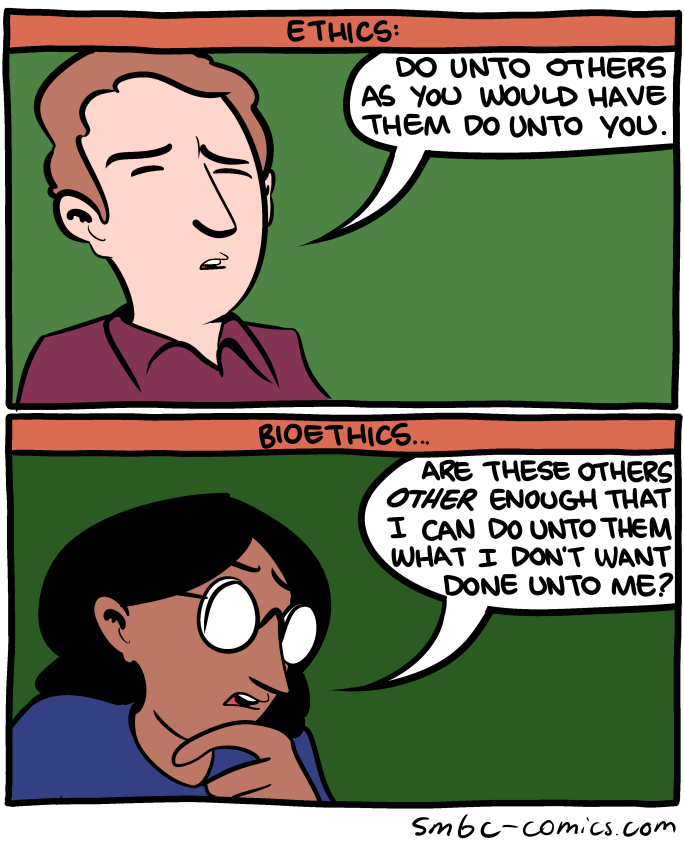
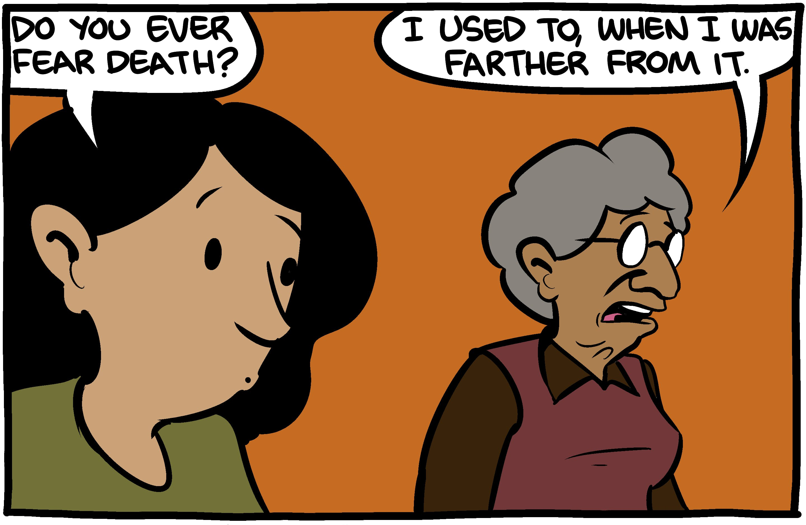
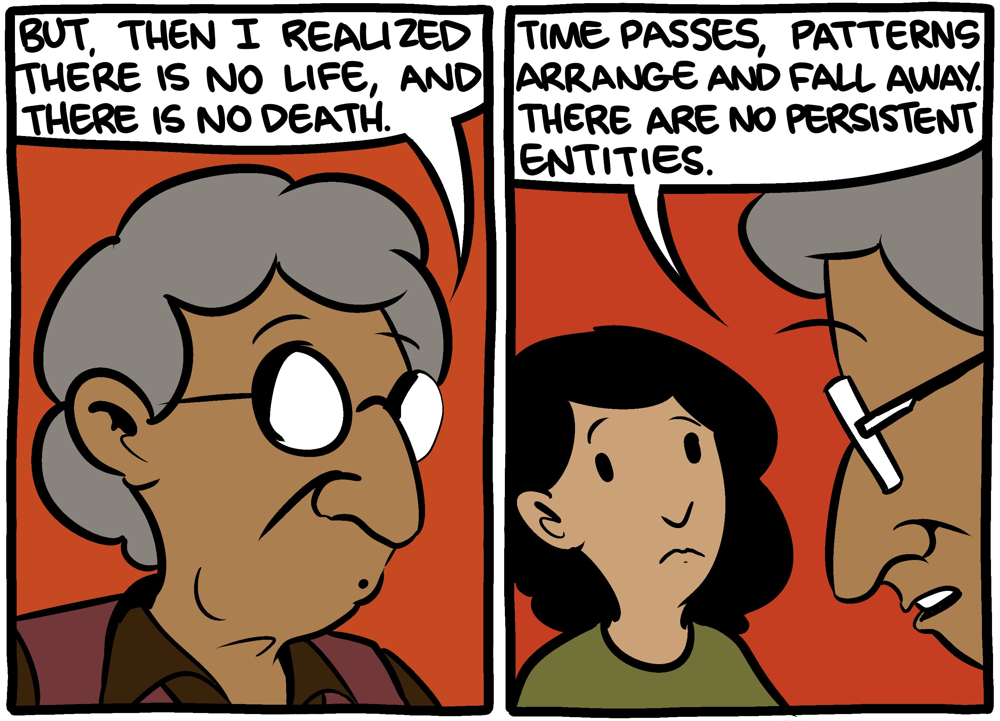
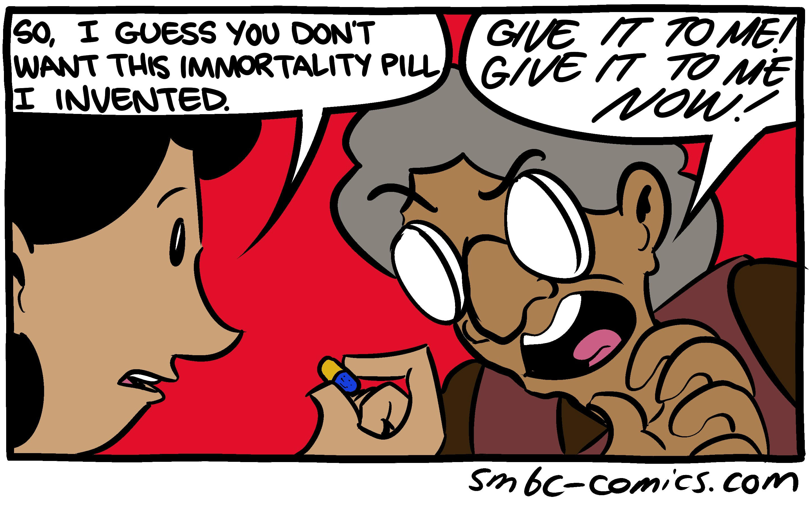

El transhumanismo
===

---Texto---

Hemos hablado del Derecho, de sus enemigos, y ahora tenemos que hablar del futuro del Derecho:

¿Como el Derecho va a cambiar, o no cambiar, dado las nuevas tecnologías y los cambios científicos?

---

Jan Krepelka

Universidad de Verano, Instituto Juan de Mariana, Lanzarote, Julio 2019

---

> ¡La libertad, la inmortalidad, y las estrellas!
>
> -- L. Neil Smith

---

## Plan

1. La libertad
2. La inmortalidad
3. Las estrellas

---

## 1.  La libertad

---Texto---

la libertad, ¿para quien? ¿quien tiene Derechos?

---

> [SMBC](http://www.smbc-comics.com/?id=3443)

---Texto---

---
¿quien tiene derechos?

¿Quienes son seres humanos titulares de derechos?

[Pelicula automata](http://www.imdb.com/title/tt1971325/) -> Turing tests

---

## 2. La inmortalidad

---

---

---

---

> [SMBC](https://thenib.com/do-you-fear-death-76fb193deec5)

---

> La situacions es muy grave, la mas grave de las que el pais ha vivido hasta hoy.

> -- José Saramago, As Intermitências da Morte

---

http://lugol.net/blog/compound-interest/

Bostrom, fabla dragon tyrante

http://www.tendencias21.net/El-envejecimiento-es-una-tiranico-dragon-que-puede-ser-abatido_a703.html

dragon tyrant
https://www.youtube.com/watch?v=iLecJrXpOEU

Iacub (porteña frances), subjetos de Derecho

Vroman, estado me esta matando

Zoltan Istvan (candidato partido libertario Caliornia)

derechos de los animales ? robots/ intelligencias artificiales ? Turing test ?

Futurama taja de interes, video + table

https://www.amazon.es/hab%C3%A9is-hecho-liberaci%C3%B3n-sexual-Discrepancias/dp/849350209X/

https://www.juandemariana.org/ijm-actualidad/analisis-diario/una-objecion-del-liberalismo-conservador-la-gestacion-subrogada#Leer

28/07/2017 - 13:10
"el derecho natural de los niños a disfrutar de un padre y de una madre (salvo en los casos de muerte de uno de los progenitores, claro está, en los que nada se puede hacer), "

¿derecho, de verdad? en varios paises ya es legal el parto anónimo, la donacion anonima de esperma, etc. tampoco es proibido el adultero, o el sexo fuera del matrimonio, y no creo que en cualquier pais un niño tiene derecho a obligarle a su madre a dirle el nombre de su amante (si por ejemplo lo esta criado sola y el padre el no lo conoce pero ella si). un tal "derecho" me pareceria por lo tanto inaplicable.

tampoco es proibido para una pareja "natural" (o un padre solo o una madre sola) de ir vivir en una comuna y de criar el niño con varias "madres" o varios "padres".

asi que me parece que la gestacion subrogada es una tecnica mas de procreacion, pero que no cambie absolutamente nada ni a los derechos reconocidos o no reconicdos de los niños, ni a las estructuras familales ya possibles o no possibles.

independemente de esto, claro que es legitimo tener una opinion de cuales son las mejores formas de criar a un nino y estructuras familales para hacerlo, pero si es fuera del derecho es fuera del liberalismo, y me parece un asunto no directamente ligado a lo de la gestacion subrogada.

Et pour rappel, dans le droit positif français :

- une personne a le droit de tomber enceinte (aucune loi ne l'interdit) ;
- une fois enceinte, elle a le droit d'avorter (un foetus n'a donc pas de droit à la vie) ;
- une fois qu'elle a accouché, aucune loi ne l'oblige à révèler l'identité du père (pas de droit absolu d'un enfant a connaître son père) ;
- elle peut même, avant d'accoucher, opter pour l'accouchement sous X (pas de droit absolu d'un enfant à connaître sa mère)
- dans ce cas l'enfant peut être adopté (pas de droit absolu de l'enfant à grandir avec ses parents biologiques, ni de connaître leur identité, ni de choisir ses parents adoptifs)
- une fois né, l'enfant est une personne qui a le droit de ne pas être tuée, ni mutilée (à part, selon son sexe, la circoncision malheureusement), ni violée, etc.

voici donc les droits reconnus et non reconnus du foetus et de l'enfant. est-ce qu'une éventuelle légalisation de la GPA (et, folie française, on en est bien loin mais on s'indigne quand même) changerait quoi que ce soit à ce cadre juridique, et notamment au statut juridique de l'enfant (qui passerait de personne à marchandise) ? bien entendu que non.

## 3. Las estrellas

http://lugol.net/blog/how-to-compare/

How to compare?

The difference between Paasche and Laspeyres indices* highlights the problem of comparing two states of the world, with changes both in prices and quantities. Scitovsky ("A Note on Welfare Propositions in Economics", 1941) applied a similar reasoning to welfare economics.

The issue is analogous to thinking about how it would feel to be, say, rich, famous, married, dead, a woman, etc. The fact is that you can only think about it from your perspective of poor, not famous, single, alive, a man, etc., and you can never know how it would really be, because if you actually were there, you would be evaluating it from the perspective of rich, famous, married, dead, a woman, etc. which might be entirely different. Since in that case you can't isolate the two (the change in the actual state of the world and the change in how you perceive it), it's like comparing two states of the world with both different prices and baskets of goods.

*Paasche: comparing prices of the t1 basket in t0 and t1
Laspeyres: comparing prices of the t0 basket in t0 and t1.

2007-06-15

http://laissez-faire.ch/en/articles/transhumanism-the-next-step-of-civilization/

Aubrey de Grey
https://www.ted.com/talks/aubrey_de_grey_says_we_can_avoid_aging

### 3.2. Las estrellas, simbolicamente

+ brief history of tomorrow de Yuval citaciones, modificaciones de deseos, etc.

Yuval Noah Harari, [Homo Deus: Breve historia del mañana](https://www.amazon.es/Homo-Deus-Breve-historia-mañana-ebook/dp/B01JQ6YNRE/)

+ Prometheus Rising, drogas, etc.

### 3.1. Las estrellas, literlamente

---

<video data-autoplay src="media/wanderers.mp4"></video>

---
