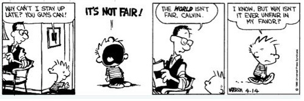
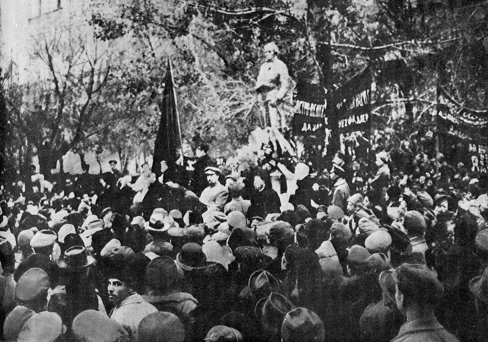
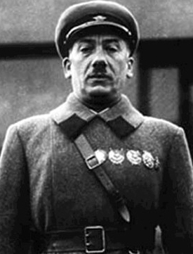
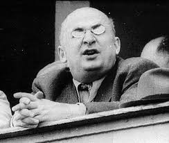
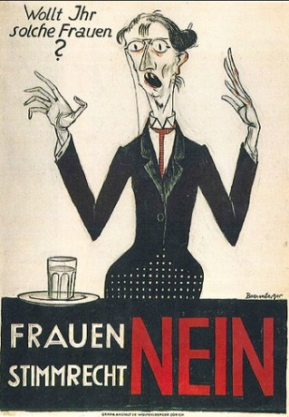
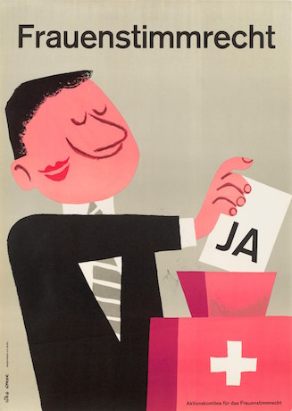
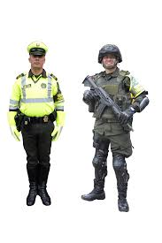
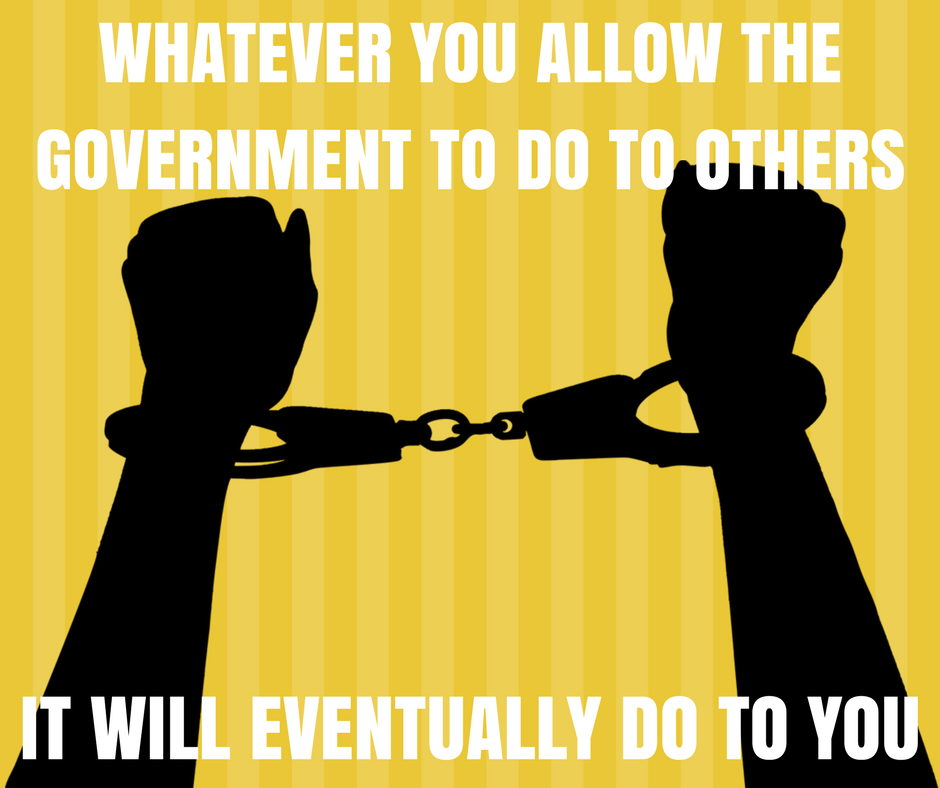

Introducción al Derecho liberal
===

---Texto---

El Derecho liberal, qué es, y por qué es importante

---

Jan Krepelka

Universidad de Verano, Instituto Juan de Mariana, Lanzarote, Septiembre 2018

---

## Plan

1. El problema: los derechos asimétricos
2. Los derechos asimétricos son nihilismo
3. La solución: el Derecho
4. Conclusión: la importancia del Derecho

---Texto---

Los derechos asimétricos, que vamos a ver los podemos definir como poder

Derecho con D mayúscula cuando es único, universal

---

## 1. El problema: los derechos asimétricos

---

### 1.1. Calvin y Hobbes

---Texto---

historieta de Calvin y Hobbes

- ¿Por qué vosotros se pueden quedar despiertos pero yo me tengo que ir a dormir?
- ¡No es justo!
- ¡El mundo no es justo, Calvin!
- Si, lo sé, pero ¿por qué no es injusto en mi favor?

¿Por qué el mundo no puede ser injusto en mi favor? -- buena pregunta! El Derecho implica un mundo justo, pero el poder, es decir, los derechos asimétricos, plantean un mundo *injusto en mi favor*. Y eso es lo que algunas personas quieren. ¿Pero como pueden asegurarse de que el mundo será *siempre* injusto en su favor, y no en el favor de los demas?

---

---Texto---

miramos otra historieta:

- Yo no creo en la ética. El fin justifica los medios. Coge lo que puedas mientras el fruto sea bueno; eso es! La ley del más fuerte; los triunfadores son los que escriben la historia. Es un mundo salvaje, así que haré lo que tenga que hacer mientras los demás discuten si está bien o no.

- Ay, ¿porque me empujas?

- Pues estabas en mi camino, ahora no lo estas mas, el fin justifica los medios

- ¡Pero no seas tonto! ¡No quise decir que sirviera para todo el mundo! ¡Sólo para mí!

Y eso es el problema: querer libertad absoluta, derecho asimétrico absoluto de hacer lo que le da las ganas, sin responsabilidad para sus acciones, poder sobre los demás -- para si mismo. Pero al mismo tiempo, ¿Como proteger se de esa misma voluntad de los demás? Es aun posible de asegurar se de ser el único a poder disfrutar de ese poder?

---

### 1.2. Robespierre

Maximilien de Robespierre (1758-1794)

---Texto---

Otro ejemplo más concreto:

Robespierre, uno de los líderes de la Revolución francesa, miembro influyente del Comité de Salvación Pública, especialmente durante la época del Terror, en la cual el comité podía ordenar arbitrariamente la guillotina, y lo hizo para miles de personas. Se estima que quinientos mil personas fueron encerradas y cien mil ejecutadas o masacradas durante los dos años de la Terror.

Robespierre introduzco en la ley francés el concepto de "enemigo del pueblo", la justificación perfecta para las ejecuciones. ¿Pero quiénes son esos enemigos del pueblo? Es decir, ¿quien decide quien lo es y quien no lo es? Eso es también un poder, un derecho asimétrico -- o, a lo menos, como Calvin, algo que sus tenedores *querían* que sea un derecho asimétrico. Y un derecho asimétrico que, porsupuesto, no pertenece al "pueblo" entero pero a algunos individuos muy específicos.

De hecho, ¿como acabo el señor Robespierre? Pues, guillotinado a su vez (en la plaza de la Revolución), es decir, matado por el proprio sistema que había creado y aprovechado.

---

---Texto---

Robespierre ha sido una inspiración para los comunistas rusos mas de un siglo después: [una estatua en su honor](https://en.wikipedia.org/wiki/Robespierre_Monument) fue uno de los primeros monumentos ordenados por Lenin, que lo consideraba como un precursor del comunismo: es decir, un precursor de las ejecuciones arbitrarias, del terror estatal.

Los comunistas soviéticos también tenían comités arbitrarios, las troikas (tres personas con poder de decisión de vida y de muerta).

Y también llamaban "enemigos del pueblo" a los que querían eliminar, y también lo pusieron en la ley

Y también han tenido un periodo de Terror particularmente terrible, durante el reino de Stalin.

La policía política de Stalin, la [NKVD](https://es.wikipedia.org/wiki/NKVD), ha tenido tres jefes :

---

## 1.3. La troika del NKVD

|Генрих Ягода|Николай Ежoв|Лаврентий Берия|
|---|---|---|
||||
|[Guénrij Yagoda](https://es.wikipedia.org/wiki/Gu%C3%A9nrij_Yagoda)|Nikolái Yezhov|[Lavrenti Beria](https://es.wikipedia.org/wiki/Lavrenti_Beria)|
|(1934-1936)|(1936-1938)|(1938-1953)|

---Texto---

Tienen dos cosas en común:

* La primera, todos fueron criminales ordenando detenciones y ejecuciones arbitrarias, con falsas acusaciones, y confesiones obtenidas con torturas;

* La segunda, todos han acabado de la misma manera que han tratado a los demás: acusados falsamente, detenidos y ejecutados arbitrariamente, y torturados hasta la obtención de confesiones extravagantes.

Y también, como los revolucionarios franceses, no fueron los únicos: casi todos los bolcheviques iniciales fueron exterminados por ellos, siguiendo las órdenes de Stalin. Nadie estaba protegido. Tomamos el ejemplo de Yezhov:

Yezhov introduzco en 1937 el Orden 447 del NKVD, que establecía cuotas de personas a matar o encerrar en el Gulag, basado en listas a decidir por troikas -- es decir, tres personas del partido que decidieran quien iba a vivir y quien a morir. Cientos de miles de personas fueron ejecutadas y millones detenidas.

¿Y como acabo ese señor, Yezhov ?

---

> Fue encerrado en la lóbrega prisión especial del NKVD de Sujánovka (Сухановка), reservada a «enemigos del pueblo especialmente peligrosos», situada a las afueras de Moscú. Allí fue acusado de espionaje en favor de Alemania, Gran Bretaña, Polonia y Japón; de dirigir una confabulación en el seno del NKVD, de preparar un golpe de Estado, organizar algunos asesinatos y de sodomía. Incapaz de soportar la tortura a la que se le sometió, aceptó todas las acusaciones. ([wikipedia](https://es.wikipedia.org/wiki/Nikol%C3%A1i_Yezhov#Declive_y_muerte))

---Texto---

... y por supuesto, fue fusilado, como los que el mismo habia condenado.

Pero los fusilamientos, por supuesto, no acabaron ahí, y siguieron en cada país donde el poder ganó sobre el Derecho.

---

<video data-autoplay src="media/che-guevera.mp4"></video>

---

## 2. Los derechos asimétricos son nihilismo

---Texto---

¿Que fueron pensando estas personas los momentos antes de morir? ¿Creían que fue un error del Partido hasta el último momento? ¿Les había parecido justa su condenación?

¿Pero con cuales principios hubieran podido rechazarla?

Vamos a ver un extracto de la película *Big Lebowski* que ilustra el problema:

---

<video data-autoplay src="media/nihilists-not-fair.mp4"></video>

---

### 2.1. El concepto robado

---Texto---

Eso es una ilustración de la falacia del concepto robado: los nihilistas rechazan el concepto de justicia, hasta el momento en que lo necesitan para su mismos. Pero ya es demasiado tarde. Los revolucionarios franceses creían que la ilusión de la "voluntad del pueblo" y sus "enemigos" solo iba a ser usada contra los enemigos personales de ellos, y jamas contra ellos mismos. Lo mismo ocurrió con los comunistas y las decisiones "del partido" en nombre del pueblo o del proletariado... Rechazan el Derecho como algo burgués, y han terminado siendo víctimas de las propias violaciones del Derecho que ellos han creado

La arbitrariedad de las decisiones de los comités y de las troikas es de hecho parecida al nihilismo. Y no es casualidad:

---

> En su ultimo estadio, el comunismo no constituye una victoria del derecho socialista, sino una victoria del socialismo sobre el proprio Derecho.
>
> -- [Пётр Иванович Стучка](https://fr.wikipedia.org/wiki/P%C4%93teris_Stu%C4%8Dka), presidente del Tribunal Suprema de la Rusia soviética, [Энциклопедия государства и права, Vol. 3, 1927, p. 1593](http://136.243.13.116:88/Viewer.html?file=/Book/pdf/119204.pdf&embedded=true#page=797&zoom=90,-144,677).

---Texto---

Y eso ya lo vemos en Marx:

---

> En una fase superior de la sociedad comunista, cuando haya desaparecido la subordinación esclavizadora de los individuos a la división del trabajo, y con ella, el contraste entre el trabajo intelectual y el trabajo manual; cuando el trabajo no sea solamente un medio de vida, sino la primera necesidad vital; cuando, con el desarrollo de los individuos en todos sus aspectos, crezcan también las fuerzas productivas y corran a chorro lleno los manantiales de la riqueza colectiva,

---

> sólo entonces podrá rebasarse totalmente el estrecho horizonte del derecho burgués y la sociedad podrá escribir en sus banderas:
> ¡De cada cual, según sus capacidades; a cada cual según sus necesidades!
>
> -- [Karl Marx, 1875](https://www.marxists.org/espanol/m-e/1870s/gotha/gotha.htm)

---Texto---

Para los comunistas, el enemigo era el Derecho. El Derecho, como protección contra la arbitrariedad, contra el poder. Ese poder, lo vemos en ese eslogan comunista típico: ¿quién determina las "capacidades" de cada uno, y quién determina las "necesidades"? Esos son conceptos muy subjetivos, que así dan el poder de interpretación a algunos individuos, como si tenián derechos asimétricos de así controlar la vida de los demás.

Lo que acabamos de ver es la oposición entre dos principios:

- por un lado, la protección que el Derecho otorga para no ser robado y matado arbitrariamente: nadie quiere vivir en una sociedad en la cual cualquier persona lo pueda matar, robar o esclavizar ;

- por el otro lado, la búsqueda del poder sobre los demás.

La solución es que para lograr esa protección del Derecho hay que rechazar su proprio poder: el poder tiene como precio de someterse a sí mismo también al poder, y la protección del Derecho tiene como precio de respectar el Derecho, también cuando se trata de los demás.

---

### 2.2. Autoridad divina

---Texto---

Si los comunistas pretendían tener sus derechos asimétricos gracias al pueblo, a la dictadura del proletariado, también hay otras fuentes, otros pretextos...

---

> Convencidos éstos de que los gobernantes tienen su autoridad recibida de Dios, se sentirán obligados en justicia a aceptar con docilidad los mandatos de los gobernantes y a prestarles obediencia y fidelidad, con un sentimiento parecido a la piedad que los hijos tienen con sus padres. «Todos habéis de estar sometidos a las autoridades superiores ».

---

> Despreciar el poder legítimo, sea el que sea el titular del poder, es tan ilícito como resistir a la voluntad de Dios. Quienes resisten a la voluntad divina se despeñan voluntariamente en el abismo de su propia perdición. «Quien resiste a la autoridad resiste a la disposición de Dios, y los que la resisten se atraen sobre sí la condenación ».
>
> -- [Carta Encíclica Immortale Dei Del Sumo Pontífice León XIII Sobre La Constitución Cristiana Del Estado](http://w2.vatican.va/content/leo-xiii/es/encyclicals/documents/hf_l-xiii_enc_01111885_immortale-dei.html), 1885

---Texto---

"Sea el que sea el titular del poder"...

Y no es sólo el catolicismo, el protestantismo también ha sido utilizado por algunas personas para defender el poder:

---

> Así también uno debe aceptar la autoridad del gobernante. Uno debe obedecerle únicamente por el amor de Dios, porque él está en el lugar de Dios. Que impongan impuestos tan intolerables como pueden: uno debe obedecerles y sufrir todo pacientemente, por el amor de Dios.
>
> Martín Lutero

---Texto---

El problema con esta tesis, por supuesto, es *quién* tiene "su autoridad recibida de Dios"? "Sea el que sea el titular del poder"... Pero ¿como se ha llegado a esa situacíon? ¿Cual es el poder "legítimo" ?

Y al final si hay conflicto y el rey esta remplazado por otro rey, !el también tendrá su autoridad de Dios!

Históricamente: las dinastías cambian, hay conquistas por guerra, y al final son reconocidas por el Vaticano.

Al final es lo mismo que todo argumento de pueblo o raza superior, o cualquier casta superior con derecho a mandar: si otra logra a superarla, es que obviamente no era tan superior. Al final, es una declaración un poco mas sofisticada del básico derecho del mas fuerte, que es nada mas que una forma de nihilismo, o sea, *el resultado* del nihilismo.

Vamos a ver otro extracto de película, la de *El hombre que quiso ser rey*:

---

<video data-autoplay src="media/englishmen.mp4"></video>

---Texto---

Como si hubiere esa hierarquía:

- Dios
- Reyes
- Ingleses
- Otras personas

Pero en realidad, ninguno de los que afirman tener algún derecho asimétrico ha jamas llevado la prueba de porqué el hecho de ser Inglés, o blanco, o miembro del comité revolucionario, o cualquier otro pretexto, seria justificación para tener derechos distintos. Son nada mas que pretextos de algunas personas, que desean poder, para tomar este poder sobre otras personas, nada mas.

Y esa película, ¿cómo acaba? El personaje de Sean Connery acaba herido por una mujer que él quería tomar como esposa contra su voluntad, y la gente, su "pueblo", ve que tiene sangre: la misma sangre roja que ellos, entonces, ¿por qué tendría él derechos distintos de ellos?

---

---Texto---

Y por supuesto, la teoría del derecho divino no es exclusiva con otras teorías, incluso la democracia.

---

### 2.3. Democracia

---Texto---

¿Y la democracia? Pues es exactamente lo mismo. Sólo que la "voluntad del pueblo" ha tomado el puesto del "derecho divino": el sistema democrático también depende de accidentes históricos, no de una decisión oficial, única, divina o universal: las fronteras, el sistema electoral, las preguntas sometidas a los votantes, los candidatas, etc, todo eso depende de decisiones históricas, que no tienen ninguna legitimad particular frente a otros sistemas posibles.

Incluso la democracia directa: en Suiza, por ejemplo, ¿vosotros sabéis quien ha dado el derecho de votar a las mujeres suizas?

---

|||
|---|---|
|||

---Texto---

Pues los hombres Suizos. En 1959 nos preguntaron por primera vez, a nosotros varones Suizos.... tíos, esas chicas, las queréis dar el derecho de votar? [hhmmm naaah](https://www.youtube.com/watch?v=ClXAaGoT5eE). Lo rechazamos.

Y después, en 1971, hace 50 años, la misma pregunta... Mirad tíos, ahora esas chicas son un poco mas listas, seguro no les queréis dar el derecho de votar? Pues, ok, vale...

Pero... Si los hombres han dado el derecho de votar a las mujeres Suizas, esa mitad de la poblacíon, quien ha dado el derecho de votar a los hombres Suizos, la otra mitad de la población? Por qué no ha sido lo contrario? Por qué los hombres tendrían el derecho de otorgar o no otorgar el derecho de votar a las mujeres?

Nada de absoluto, universal. Nada de justificado en Derecho. De nuevo, accidente histórico, grupos de personas, dependiendo de relaciones de fuerza, que toman poder o no lo toman, y que construyen algunas instituciones. En este caso, algunas instituciones hechas por los hombres.

Las feministas suizas también hubieran podido hacer su proprio estado paralelo, sus proprias instituciones, con la misma autoridad, o ausencia de autoridad, que las instituciones construidas por los hombres.

---

## 3. La solución: el Derecho

---Texto---

Y eso nos lleva a la posición liberal. El liberalismo, en ese sentido, no es nada mas que la teoría mas avanzada de la ciencia del Derecho. El liberalismo es un grupo de soluciones a varios problemas jurídicos, pero lo mas importante es el marco: El Derecho universal, el derecho de propriedad privada, que se puede justificar de manera puramente lógica, y que por lo tanto es incontestable para cualquier persona que quiere rechazar el nihilismo.

---

### 3.1 Universalidad del Derecho

---Texto---

Identidad de los derechos de cada ser humano.

---

> Sostenemos como evidentes estas verdades: que los hombres son creados iguales; que son dotados por su Creador de ciertos derechos inalienables; que entre estos están la vida, la libertad y la búsqueda de la felicidad.
>
> -- [Declaración de Independencia de los Estados Unidos](https://es.wikisource.org/wiki/Declaración_de_Independencia_de_los_Estados_Unidos_de_América), 1776

---

> Los hombres nacen y permanecen libres e iguales en derechos.
>
> -- [Declaración de los Derechos del Hombre y del Ciudadano](http://www.conseil-constitutionnel.fr/conseil-constitutionnel/root/bank_mm/espagnol/es_ddhc.pdf), 1789

---

> Los individuos tienen derechos, y esos derechos son independientes de la autoridad social, quien no les puede tocar sin hacerse culpable de usurpación.
>
> -- Benjamin Constant, *[Sobre los derechos individuales](http://fr.liberpedia.org/Des_droits_individuels)*, 1818

---

### 3.2 ... por cualquier sexo

> Las mujeres son seres humanos, y por lo tanto tienen los mismos derechos naturales que todo ser humano puede tener.
>
> -- [Lysander Spooner, 1877](http://www.enemigosdelestado.com/contra-sufragio-femenino-spooner-lysander/)

---Texto---

Y podríamos añadir que el sexo no es relevante para el Derecho. Es como la color de su pelo, o el hecho de tener pelo o no tenerlo: no cambia nada respecto a los derechos de cada persona. Así que todas las cuestiones sobre el cambio de sexo, el matrimonio gay, etc, no son cuestiones relevantes para el Derecho.

---

### 3.3 ... en cualquier lugar

> En una edad más culturalmente confiada, a los británicos en La India se les planteó la práctica del "sutí" -- la tradición de quemar a las viudas en las piras funerarias de sus maridos. El General Sir Charles Napier fue impecablemente multicultural:

---

> "Ustedes dicen que quemar a las viudas es su costumbre. Muy bien. Nosotros también tenemos una costumbre: cuando los hombres queman viva a una mujer, atamos una soga alrededor de sus cuellos y los ahorcamos. Construyan su pira funeraria. Detrás de ella, mis carpinteros construirán unas horcas. Ustedes pueden seguir su costumbre. Y después nosotros seguiremos las nuestras".
>
> -- [Mark Steyn](https://books.google.es/books?id=thP_UKhPbP0C&pg=PA193&lpg=PA193&dq=%22General+Sir+Charles+Napier%22+%22my+carpenters+will+build+a+gallows.%22&source=bl&ots=k-xwQ6v5z8&sig=38ge9XwtlbctCiVMJeuYpJgi_tQ&hl=en&sa=X&ved=0ahUKEwjO1ePlxqLVAhUBLMAKHYcYCg8Q6AEIMjAD#v=onepage&q&f=false) [ [traducción](http://blogs.periodistadigital.com/tizas.php/2006/04/15/una-cultura-y-un-rebano-de-dementes) ]

---

### 3.4 ... sí, en serio.

[Convenio para la Protección de los Derechos Humanos y de las Libertades Fundamentales](http://www.echr.coe.int/Documents/Convention_SPA.pdf)

> ARTÍCULO 4
> Prohibición de la esclavitud y del trabajo forzado
> 1. Nadie podrá ser sometido a esclavitud o servidumbre.
> 2. Nadie podrá ser constreñido a realizar un trabajo forzado u obligatorio.
> 3. No se considera como „trabajo forzado u obligatorio“ en el sentido del presente artículo:

---

> ...
>
> b) todo servicio de carácter militar
>
> ...
>
> d) todo trabajo o servicio que forme parte de las obligaciones cívicas normales.

---Texto---

Es como decir, vamos a prohibir el Gulag, pero con la excepción del campamento número treinta y ocho, que no vamos a llamar Gulag sino Disneyland.

---

### 3.5 Contra el sombrero mágico

---Texto---

Y eso nos lleva poco a poco a la distinción fundamental tras los liberales en el censo correcto, y los liberales en el sentido mas común, el de los estados occidentales, de las llamadas democracias liberales.

---

---

---

---

---

---Texto---

Nosotros liberales somos los ateístas del sombrero mágico: no hay ningún sombrero mágico que pueda otorgar a una persona derechos que no tenía antes.

---

## 4. Conclusión

---Texto---

Al final, los enemigos del derecho, que se declaran así, o que buscan pretextos, o que se declaran nihilistas, quieren lo mismo : sus propios derechos protegidos, y el poder de hacer lo que quieran con las vidas de los demás.

Por supuesto, esto no puede funcionar jamas. Que esto llega a una sociedad totalitaria, o a una sociedad anomística, el problema es lo mismo: la ausencia de seguridad jurídica. El caos es lo mismo. Los primitivistas y los tecnócratas ambos se oponen al Derecho.

La alternativa es Derecho, sí o no. Es decir, por un lado, un Derecho universal, para todas las personas, en todas partes, que ofrece seguridad, prosperidad, etc.; y por otro lado, el caos, los asesinatos (que sean organizados por estados o no parados por estados), la pobreza (que sea causada deliberadamente por decisión del estado, o por su destrucción de los derechos de propriedad).

Al final, todos son nihilistas que quieren el poder, es decir, que critican al Derecho porque quieren el poder de hacer lo que quieran.

Son nihilistas deshonestos, nada más.

Sin liberalismo, hay desorden, hay anomia, es la ley del más fuerte, es la guerra de todos contra todos.

El Derecho liberal es el único marco que ofrece una sociedad civilizada, pacífica, donde la protección de los derechos de cada uno incluye la responsabilidad de no atentar a los derechos de los demás.

Históricamente, todo el progreso que hemos tenido ha sido posible gracias al grado de respeto parcial de los derechos de propriedad. Con mas respecto aún, ya seriamos capaces de hacer muchísimo mas.

---

¡Muchas gracias!
