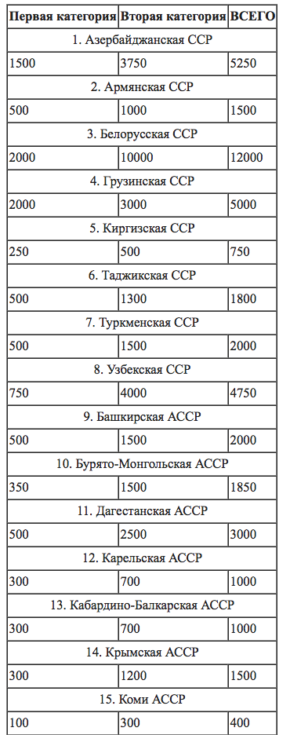
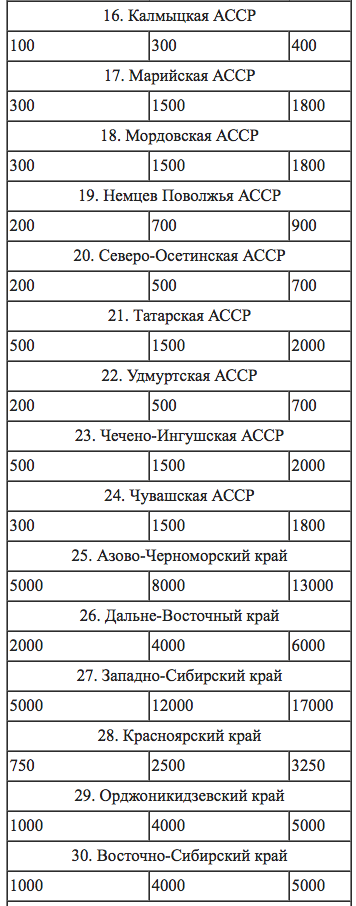
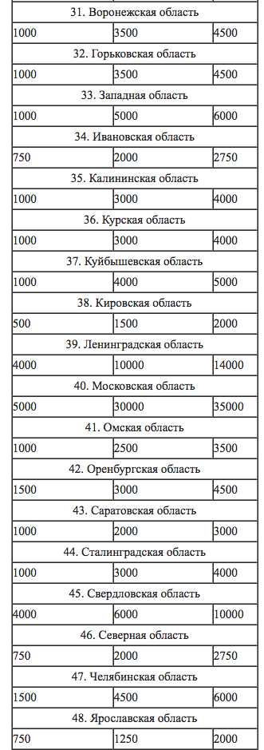
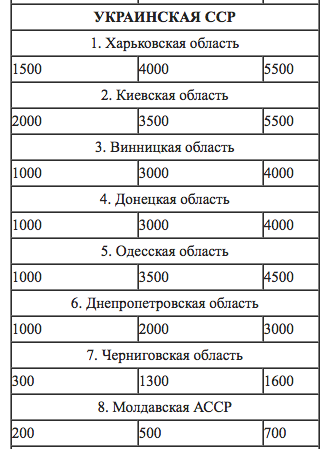
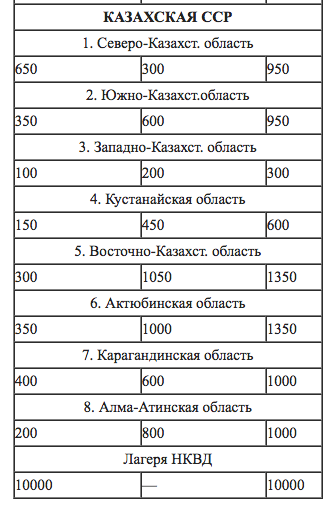

(cut for pres, use for full text article ? youtube links to clips ?)

do all three :

Derecho liberal
Los enemigos del Derecho
El transhumanismo

Cut, use for another pres:

El Derecho y sus enemigos
===

1. El Derecho natural
2. Sus enemigos
2.1 socialismo

etc.

Hoppe, principio de non agression

### 3.5 categorías equivocadas

Liberpedia/Droit

los con cabello y los sin

http://fr.liberpedia.org/Chauve

http://fr.liberpedia.org/Droit

## simetria 1

ostracismo

## simetria 2

legalizar es prohibir

[camiseta: legalize everything]

## Hoppe: no se puede rechazar el Derecho

Grotius
Schopenhauer

Escuela de Salamanca

Cicero

https://es.wikipedia.org/wiki/Derecho_natural

https://es.wikipedia.org/wiki/Escuela_de_Salamanca#Derecho_natural_y_derechos_humanos

https://www.juandemariana.org/ijm-actualidad/analisis-diario/francisco-de-vitoria-y-la-justicia-universal

https://www.wikiberal.org/wiki/%C3%89cole_de_Salamanque#Droit_naturel_et_droits_humains

http://www.uca.edu.ar/esp/sec-fderecho/subs-leynatural/esp/docs-congresos/2-jornada/ponencias/rizzo.pdf

https://es.wikipedia.org/wiki/Gabriel_V%C3%A1zquez

Los enemigos del Derecho
===

> в его последней стадии коммунизм представлятся не как победа социалистического права, а как победа социализма над правом вообще.

---

> La ideología burguesa del Derecho ha tomado el puesto de Dios, deificando así su fetiche del Derecho.
> 
> -- [Пётр Иванович Стучка](https://fr.wikipedia.org/wiki/P%C4%93teris_Stu%C4%8Dka), presidente del Tribunal Suprema de la Rusia soviética, [Энциклопедия государства и права, Vol. 3, 1927, p. 424](http://136.243.13.116:88/Viewer.html?file=/Book/pdf/119204.pdf&embedded=true#page=212&zoom=130,-22,842).

---Texto---

> А буржуазное мировоззрение в право поставившее закон на место бога, как раз заключается в обожествлении фетишизации закона.

Las personas que eran condenadas pero no a muerte eran condenadas a 10 años en el Gulag. Gulag es un acrónimo ruso, en el cual el "lag" significa "lager", que es la palabra alemán (la misma que en los campos de concentración Nacionalsocialistas) prestada al ruso. En Cecho, idioma de un país que ha conocido y campos de concentración Nacionalsocialistas y los socialistas, la misma palabra se usa para ambos.

Pero ni siquiera en los "Lageres" las personas eran aseguradas de vivir:

(en ese periodo, se estima que el cuarto de los prisioneros moría por hambre, maltratamientos, durante el trasporte, etc. Pero ademas,)

Miramos las cuotas oficiales del orden de Yezhov:

---

||||
|---|---|---|
||||

---Texto---

Esos son las cifras para varias regiones de la Unión soviética ([wikipedia](https://ru.wikisource.org/wiki/Приказ_НКВД_от_30.07.1937_№_00447#II._.D0.9E_.D0.9C.D0.95.D0.A0.D0.90.D0.A5_.D0.9D.D0.90.D0.9A.D0.90.D0.97.D0.90.D0.9D.D0.98.D0.AF_.D0.A0.D0.95.D0.9F.D0.A0.D0.95.D0.A1.D0.A1.D0.98.D0.A0.D0.A3.D0.95.D0.9C.D0.AB.D0.9C_.D0.98_.D0.9A.D0.9E.D0.9B.D0.98.D0.A7.D0.95.D0.A1.D0.A2.D0.92.D0.95_.D0.9F.D0.9E.D0.94.D0.9B.D0.95.D0.96.D0.90.D0.A9.D0.98.D0.A5_.D0.A0.D0.95.D0.9F.D0.A0.D0.95.D0.A1.D0.A1.D0.98.D0.98.))

Cada linea es una región. La primera columna es la primera categoría de enemigos del pueblo, los "mas peligrosos", destinados a ejecución por fusilamiento. La segunda son la segunda categoría, las cifras de personas que hay que condenar solo a 10 años en el Gulag.

---

|||
|---|---|
|||

---Texto---

Mirad la ultima linea: alguien me puede decir ¿porque falta un numero?

...

pues esa ultima linea no es una región en el sentido común, pero sí es una en el sentido de Солженицын: es el archipiélago del Gulag: "Лагеря НКВД". son las cuotas de personas ya trabajando hasta la muerto en en frío, ya condenadas, pero que todavía había que matar.

(Хрущёв, charla culto de la personalidad, 4 horas polaco Kołakowski: como ha sido posible ?)

## 4. Los enemigos del Derecho

## 4.1. Criticos del Derecho

## 4.2. Criticos de los derechos humanos

## 4.3. Falsos derechos (positivos)

## 4.4 Falsas igualdades

trampa falsas igualdades ( loving vs virginia )

## 4.4. Dignidad humana

> Todos los seres humanos nacen libres e iguales en dignidad y derechos y, dotados como están de razón y conciencia, deben comportarse fraternalmente los unos con los otros.

http://www.un.org/es/universal-declaration-human-rights/ La Declaración Universal de Derechos Humanos (Naciones Unidas, 1948)

## 4.5. Collectivismo

> For liberalism, the individual is the end and society the means; nor is it conceivable that the indivual, considered in the dignity of an ultimate finality, be lowered to mere instrumentality.
> For Fascism, society is the end, individuals the means, and its whole life consists in using individuals as instruments for its social ends.
>
> Alfredo Rocco, from 1925 to 1932 he was Minister of Justice of fascist Italy, The Political Doctrine of Fascism, 1925

---

## 4.6. Derecho vs poder

def. poder ;-)

Power is having the discretion and the means to asymmetrically enforce one’s will over others.
[Le pouvoir consiste à détenir la discrétion et les moyens d'imposer asymétriquement sa volonté sur les autres.]
Interpersonal Power: A Review, Critique, and Research Agenda

https://serval.unil.ch/resource/serval:BIB_1F6C29A616C0.P001/REF

> Las mujeres son seres humanos, y por lo tanto tienen los mismos derechos naturales que todo ser humano puede tener. Tienen tanto derecho a hacer leyes como lo tienen los hombres; Y ESTO QUIERE DECIR QUE NO TIENEN DERECHO ALGUNO. Ningún ser humano, ni ningún grupo de seres humanos, tienen derecho a hacer leyes, y obligar a otros seres humanos a obedecerlas. Decir que tienen este derecho es decir que ellos son dueños y amos de aquellos a quienes requieren obediencia.

> La única ley que cualquier ser humano puede legítimamente ser obligado a obedecer es simplemente la ley de la justicia. Y la justicia no es una cosa que se pueda hacer, o deshacer, o alterar, por ninguna autoridad humana. Se trata de un principio natural, inherente a la naturaleza misma del hombre y de las cosas. Es ese principio natural que determina lo que es mío y lo que es tuyo, lo que es el derecho o propiedad de uno y lo que es el derecho o propiedad de otro. Es, por así decirlo, la línea que la Naturaleza ha establecido entre los derechos y propiedad de un hombre, y los derechos y propiedad de otro hombre.

> Este principio natural, que llamamos justicia, y que asignamos a cada ser humano, es, repito, no una cosa que se ha hecho, sino un tema de la ciencia que hay que entender, como las matemáticas, la química o la geología. Y todas las leyes, así llamadas, que los hombres han hecho nunca, ya sea para crear, definir, o controlar los derechos de las personas, son intrínsecamente tan absurdas y ridículas como lo sería crear leyes para definir o controlar las matemáticas, la química, o la geología.

