Introduction to Liberal Law
===

---Text---

Liberal/Libertarian/Natural Law, what it is, and why it is important

---

Jan Krepelka

Liberty Camp Spain 2024, Malaga, Spain, July 2024

---

## Plan

1. The problem: asymmetric rights
2. Asymmetric rights are nihilism
3. The solution: Law
4. Conclusion: the importance of Law

---Text---

Asymmetric rights, which we will see, can be defined as power.

Law with a capital L when it is unique, universal

---

## 1. The problem: asymmetric rights

---

### 1.1. Calvin and Hobbes

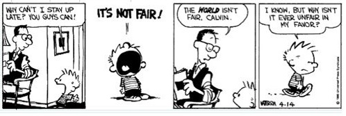

---Text---

Calvin and Hobbes comic strip

- Why can you all stay up but I have to go to bed?
- It’s not fair!
- The world isn’t fair, Calvin!
- Yes, I know, but why isn’t it unfair in my favor?

Why can’t the world be unfair in my favor? -- good question! The Law implies a just world, but power, that is, asymmetric rights, propose a world *unfair in my favor*. And that’s what some people want. But how can they ensure that the world will *always* be unfair in their favor, and not in the favor of others?

---

---Text---

Let’s look at another comic strip:

- I don’t believe in ethics. The end justifies the means. Grab what you can while the getting’s good; that’s it! The law of the jungle; the winners write the history books. It’s a wild world, so I will do whatever I have to while others argue whether it’s right or not.

- Hey, why did you push me?

- Well, you were in my way, now you’re not. The end justifies the means.

- But don’t be silly! I didn’t mean it should apply to everyone! Only to me!

And that’s the problem: wanting absolute freedom, absolute asymmetric right to do whatever one wants, without responsibility for one’s actions, power over others -- for oneself. But at the same time, how to protect oneself from that same will of others? Is it even possible to ensure being the only one to enjoy that power?

---

### 1.2. Robespierre

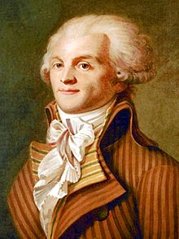

Maximilien de Robespierre (1758-1794)

---Text---

Another more concrete example:

Robespierre, one of the leaders of the French Revolution, an influential member of the Committee of Public Safety during the Reign of Terror.

The committee could arbitrarily order the guillotine, and it did so for thousands of people. It is estimated that 500,000 people were imprisoned and 100,000 executed or massacred during the 2 years of the Terror.

Robespierre introduced into French law the concept of “enemy of the people”, the perfect justification for executions. But who are these enemies of the people? That is, who decides who is and who is not? This is also a power, an asymmetric right -- or, at least, like Calvin, something that its holders *wanted* to be an asymmetric right.

In fact, how did Mr. Robespierre end up? Well, guillotined in turn (in the Place de la Révolution), that is, killed by the very system he had created and exploited.

---

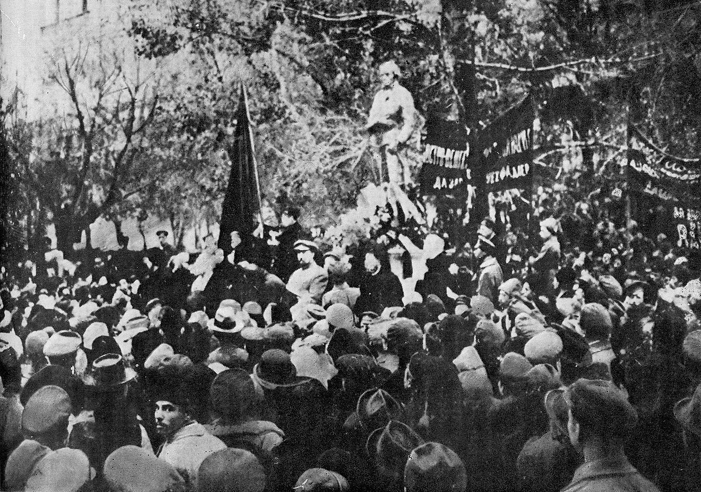

---Text---

Robespierre was an inspiration for the Russian communists more than a century later: [a statue in his honor](https://en.wikipedia.org/wiki/Robespierre_Monument) was one of the first monuments ordered by Lenin, who considered him a precursor of communism: that is, a precursor of arbitrary executions, of state terror.

The Soviet communists also had arbitrary committees, the troikas (three people with the power of life and death decisions).

And they also called those they wanted to eliminate “enemies of the people,” and they also enshrined it in law.

And they also had a particularly terrible period of Terror during Stalin’s reign, which was also called Terror, The Great Terror of 1937, also known as the Great Purge, or Ежовщина Yezhovshchina

Stalin’s political police, the [NKVD](https://en.wikipedia.org/wiki/NKVD), had three chiefs:

---

## 1.3. The NKVD Troika

|Генрих Ягода|Николай Ежoв|Лаврентий Берия|
|---|---|---|
|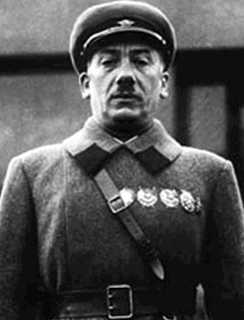|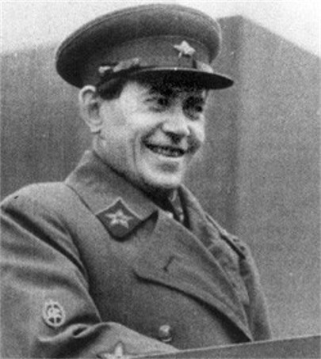|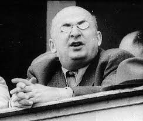|
|[Genrikh Yagoda](https://en.wikipedia.org/wiki/Genrikh_Yagoda)|Nikolai Yezhov|[Lavrentiy Beria](https://en.wikipedia.org/wiki/Lavrentiy_Beria)|
|(1934-1936)|(1936-1938)|(1938-1953)|

---Text---

They have two things in common:

* First, they were all criminals ordering arbitrary detentions and executions, with false accusations, and confessions obtained through torture;

* Second, they all ended up in the same way they treated others: falsely accused, arbitrarily detained, and tortured until extravagant confessions were obtained, and executed.

And also, like the French revolutionaries, they were not the only ones: almost all the initial Bolsheviks were exterminated by them, following Stalin’s orders. No one was protected. Let’s take the example of Yezhov:

In 1937, Yezhov introduced NKVD Order 447, which established quotas of people to kill or imprison in the Gulag, based on lists decided by troikas -- that is, three party members who decided who would live and who would die. Hundreds of thousands of people were executed and millions detained.

And how did Mr. Yezhov end up?

---

> He was confined in the grim special NKVD prison of Sukhanovka (Сухановка), reserved for “especially dangerous enemies of the people,” located on the outskirts of Moscow. There he was accused of espionage in favor of Germany, Great Britain, Poland, and Japan; of directing a conspiracy within the NKVD, preparing a coup, organizing some murders, and of sodomy. Unable to withstand the torture he was subjected to, he accepted all the accusations. ([Wikipedia](https://en.wikipedia.org/wiki/Nikolai_Yezhov#Decline_and_death))
&nbsp;
&nbsp;

---Text---

... and of course, he was shot, just like those he had condemned himself.

But the executions, of course, did not end there, and continued in every country where power triumphed over the law.

---

<video data-autoplay src="../../media/che-guevera.mp4"></video>

---

## 2. Asymmetric Rights Are Nihilism

---Text---

What were these people thinking in the moments before they died? Did they believe it was a Party error until the very end? Did their condemnation seem just to them?

But with what principles could they have rejected it?

Let’s look at an excerpt from the movie *The Big Lebowski* that illustrates the problem:

---

<video data-autoplay src="../../media/nihilists-not-fair.mp4"></video>

---

### 2.1. The Stolen Concept

---Text---

This is an illustration of the stolen concept fallacy: the nihilists reject the concept of justice until the moment they need it for themselves. But by then it is too late. The French revolutionaries believed that the illusion of the “will of the people” and its “enemies” would only be used against their personal enemies, and never against themselves.

The same happened with the communists and the decisions they made in the name of the party, the people, or the proletariat, that is, their own decisions and the illusory will of asymmetric rights.

They rejected the Law as something bourgeois, and ended up being victims of the very violations of the Law they had created.

The arbitrariness of the committee and troika decisions is actually similar to nihilism. And it is no coincidence:

---

> в его последней стадии коммунизм представлятся не как победа социалистического права, а как победа социализма над правом вообще.
>
> In its ultimate stage, communism does not constitute a victory of socialist law, but a victory of socialism over Law itself.
>
> — [Pyotr Ivanovich Stuchka](https://en.wikipedia.org/wiki/Pēteris_Stučka), President of the Supreme Court of Soviet Russia, [Encyclopedia of State and Law, Vol. 3, 1927, p. 1593](http://136.243.13.116:88/Viewer.html?file=/Book/pdf/119204.pdf&embedded=true#page=797&zoom=90,-144,677).

---Text---

And already in Karl Marx:

---

> In a higher phase of communist society, after the enslaving subordination of the individual to the division of labor, and therewith also the antithesis between mental and physical labor, has vanished [...] only then can the narrow horizon of bourgeois right be crossed in its entirety and society inscribe on its banners: 
> 
> From each according to his ability, to each according to his needs!
>
> — [Karl Marx, 1875](https://www.marxists.org/archive/marx/works/1875/gotha/)

---Text---

For the communists, the enemy was the Law. The Law, as protection against arbitrariness, against power. This power is seen in that typical communist slogan: who determines each person’s “abilities” and who determines their “needs”? These are very subjective concepts, which thus give the power of interpretation to some individuals, as if they had asymmetric rights to control the lives of others.

What we have just seen is the opposition between two principles:

- on the one hand, the protection that the Law provides to not be robbed and killed arbitrarily: no one wants to live in a society where anyone can kill, rob, or enslave them;

- on the other hand, the pursuit of power over others.

The solution is that to achieve the protection of the Law, one must reject their own power: power has the price of submitting oneself also to power, and the protection of the Law has the price of respecting the Law, also when it comes to others.

---

### 2.2. Divine Authority

---Text---

If the communists claimed their asymmetric rights thanks to the people, to the dictatorship of the proletariat, there are also other sources, other pretexts...

---

> To despise legitimate authority, in whomsoever vested, is unlawful, as a rebellion against the divine will, and whoever resists that, rushes willfully to destruction. “He that resisteth the power resisteth the ordinance of God, and they that resist, purchase to themselves damnation.” To cast aside obedience, and by popular violence to incite to revolt, is therefore treason, not against man only, but against God.
>
> — [Encyclical Letter Immortale Dei of the Supreme Pontiff Leo XIII On the Christian Constitution of States](http://w2.vatican.va/content/leo-xiii/en/encyclicals/documents/hf_l-xiii_enc_01111885_immortale-dei.html), 1885

---Text---

“in whomsoever vested”, that means, no matter who has the power, you need to obey them. of course this is very convenient for those in power.

And it’s not just Catholicism; Protestantism has also been used by some to defend power:

---

> Thus one must also bear the authority of the ruler. If he abuses it, I am not therefore to bear him a grudge, nor take revenge of and punish him with my hands. One must obey him solely for God’s sake, for he stands in God’s stead. Let them impose taxes as intolerable as they may: one must obey them and suffer everything patiently, for God’s sake.
>
> — [Martin Luther](http://www.godrules.net/library/luther/129luther_e19.htm)

---Text---

The problem with this thesis, of course, is *who* has “his authority received from God”? “Whoever the holder of power may be”... But how did it come to this? What is the “legitimate” power?

And in the end, if there is a conflict and the king is replaced by another king, he too will have his authority from God!

Historically: dynasties change, there are conquests by war, and in the end, they are recognized by the Vatican.

In the end, it is the same as any argument of a superior people or race, or any superior caste with the right to rule: if another group manages to win over it, then obviously the previous group was not all that superior. In the end, it is a slightly more sophisticated declaration of the basic right of the strongest, which is nothing more than a form of nihilism, or rather, *the result* of nihilism.

Let’s look at another movie excerpt, from *The Man Who Would Be King*:

---

<video data-autoplay src="../../media/englishmen.mp4"></video>

---Text---

As if there were this hierarchy:

- God
- Kings
- Englishmen
- Other people

But in reality, none of those who claim to have some asymmetric right has ever provided proof of why being English, or white, or a member of the revolutionary committee, or any other pretext, would justify having different rights. They are nothing more than pretexts for some people who desire power to take this power over others, nothing more.

And how does that movie end? Sean Connery’s character ends up wounded by a woman he wanted to take as a wife against her will, and the people, his “people”, see that he has blood: the same red blood as theirs, so why would he have different rights than them?

---

---Text---

And of course, the theory of divine right is not exclusive to other theories, even democracy.

---

### 2.3. Democracy

---Text---

And democracy itself? Well, it’s exactly the same. Only the “will of the people” has taken the place of the “divine right”: the democratic system also depends on historical accidents, not on an official, unique, divine, or universal decision: borders, the electoral system, the questions submitted to voters, the candidates, etc., all these depend on historical decisions that have no particular legitimacy compared to other possible systems.

Even direct democracy: in Switzerland, for example, do you know who gave Swiss women the right to vote?

---

<video data-autoplay src="../../media/applejack-nah.mp4"></video>

---Text---

Well, Swiss men. In 1959 they asked us for the first time, we Swiss men... guys, do you want to give these girls the right to vote? [hhmmm naaah](https://www.youtube.com/watch?v=ClXAaGoT5eE). We rejected it.

---

|||
|---|---|
|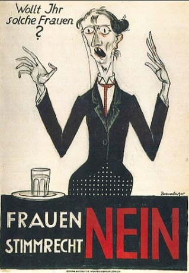|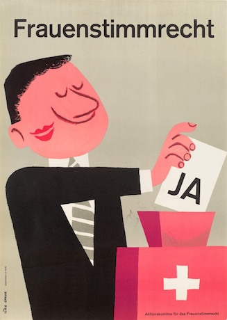|

---Text---

And then, in 1971, 50 years ago, the same question... Look guys, now these girls are a bit smarter, you sure you don’t want to give them the right to vote? Well, okay, fine...

But... If men gave Swiss women the right to vote, that half of the population, who gave Swiss men the right to vote, the other half of the population? Why wasn’t it the other way around? Why would men have the right to grant or not grant the right to vote to women?

Nothing absolute, universal. Nothing justified in Law. Again, a historical accident, groups of people, depending on power relations, that take power or do not take it, and build some institutions. In this case, some institutions made by men.

Swiss feminists could also have made their own parallel state, their own institutions, with the same authority, or absence of authority, as the institutions built by men.

---

## 3. The Solution: The Law

---Text---

And that brings us to the liberal position. Liberalism, in this sense, is nothing more than the most advanced theory of the science of law. Liberalism is a set of solutions to various legal problems, but the most important is the framework: Universal Law, the right to private property, which can be justified purely logically, and therefore is indisputable for anyone who wants to reject nihilism.

---

### 3.1 Universality of the Law

---Text---

Identity of the rights of every human being.

---

> We hold these truths to be self-evident: that all men are created equal; that they are endowed by their Creator with certain unalienable rights; that among these are life, liberty, and the pursuit of happiness.
>
> — [Declaration of Independence of the United States](https://es.wikisource.org/wiki/Declaración_de_Independencia_de_los_Estados_Unidos_de_América), 1776

---

> Men are born and remain free and equal in rights.
>
> — [Declaration of the Rights of Man and of the Citizen](http://www.conseil-constitutionnel.fr/conseil-constitutionnel/root/bank_mm/espagnol/es_ddhc.pdf), 1789

---

> Individuals have rights, and these rights are independent of social authority, which cannot touch them without becoming guilty of usurpation.
>
> — Benjamin Constant, *[On Individual Rights](http://fr.liberpedia.org/Des_droits_individuels)*, 1818

---

### 3.2 ... regardless of gender

> Women are human beings, and therefore have the same natural rights that any human being can have.
>
> — [Lysander Spooner, 1877](http://www.enemigosdelestado.com/contra-sufragio-femenino-spooner-lysander/)

---Text---

And we could add that gender is not relevant to the Law. It is like the color of your hair or the fact of having hair or not: it does not change anything regarding the rights of each person. So all the questions about sex change, gay marriage, etc., are not relevant to the Law.

---

### 3.3 ... in any place

> In a more culturally confident age, the British in India were confronted with the practice of “sati” -- the tradition of burning widows on their husbands’ funeral pyres. General Sir Charles Napier was impeccably multicultural:

---

> “You say that burning widows is your custom. Very well. We also have a custom: when men burn a woman alive, we tie a rope around their necks and hang them. Build your funeral pyre. Behind it, my carpenters will build a gallows. You may follow your custom. And then we will follow ours.”
>
> — [Mark Steyn](https://books.google.es/books?id=thP_UKhPbP0C&pg=PA193&lpg=PA193&dq=%22General+Sir+Charles+Napier%22+%22my+carpenters+will+build+a+gallows.%22&source=bl&ots=k-xwQ6v5z8&sig=38ge9XwtlbctCiVMJeuYpJgi_tQ&hl=en&sa=X&ved=0ahUKEwjO1ePlxqLVAhUBLMAKHYcYCg8Q6AEIMjAD#v=onepage&q&f=false) [ [translation](http://blogs.periodistadigital.com/tizas.php/2006/04/15/una-cultura-y-un-rebano-de-dementes) ]

---

### 3.4 ... yes, seriously.

[Convention for the Protection of Human Rights and Fundamental Freedoms](http://www.echr.coe.int/Documents/Convention_SPA.pdf)

> ARTICLE 4
> Prohibition of slavery and forced labor
> 1. No one shall be held in slavery or servitude.
> 2. No one shall be required to perform forced or compulsory labor.
> 3. For the purpose of this article the term “forced or compulsory labor” shall not include:

---

> ...
>
> b) any service of a military character
>
> ...
>
> d) any work or service which forms part of normal civic obligations.

---Text---

It’s like saying, we will ban the Gulag, but with the exception of camp number thirty-eight, which we will not call a Gulag but Disneyland.

---

### 3.5 Against the magic hat

---Text---

And that gradually brings us to the fundamental distinction between liberals in the true sense, and liberals in the more common sense, that of Western states, of so-called liberal democracies.

---

---

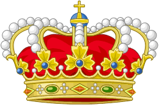

---

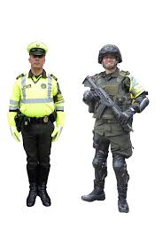

---

---

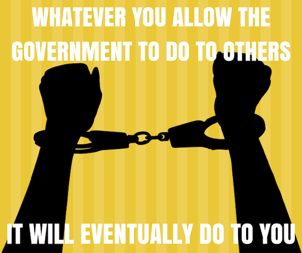

---Text---

We liberals are the atheists of the magic hat: there is no magic hat that can grant a person rights they did not have before.

---

## 4. Conclusion

---Text---

In the end, the enemies of the law, whether they declare themselves as such, seek pretexts, or declare themselves nihilists, want the same thing: their own rights protected, and the power to do whatever they want with the lives of others.

Of course, this can never work. Whether it leads to a totalitarian society or an anomistic society, the problem is the same: the absence of legal security. The chaos is the same. Both primitivists and technocrats oppose the Law.

The alternative is Law, yes or no. That is, on the one hand, a universal Law, for all people, everywhere, offering security, prosperity, etc.; and on the other hand, chaos, murders (whether organized by states or not stopped by states), poverty (whether deliberately caused by state decision, or by its destruction of property rights).

In the end, they are all nihilists who want power, that is, who criticize the Law because they want the power to do whatever they want.

They are dishonest nihilists, nothing more.

Without liberalism, there is disorder, anomie, it is the law of the strongest, it is the war of all against all.

Liberal Law is the only framework that offers a civilized, peaceful society, where the protection of each person’s rights includes the responsibility not to infringe on the rights of others.

Historically, all the progress we have made has been possible thanks to the partial respect of property rights. With even more respect, we would already be capable of much more.

---

Thank you very much!
