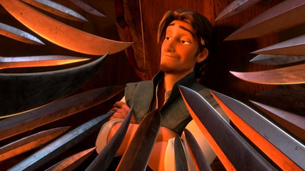

Política exterior liberal
===

(en cinco minutos)

---Texto---

Hola a todos.

Quería aprovechar esta ocasión para hablar de un tema que quizá no va a gustar a todos, algo que constituye un punto bastante débil de varias corrientes liberales, la política exterior.

---

* Murray Rothbard
* Hans-Hermann Hoppe

---Texto---

Todos conocemos a Murray Rothbard, a quien algunos consideran el fundador del anarcocapitalismo. Rothbard era un gringo que no entendía bien Europa y se equivocaba mucho en temas relacionados con nuestra historia y los conflictos del siglo pasado, como el peligro de la Unión Soviética y la Segunda Guerra Mundial.

A Murray Rothbard lo siguió Hans-Hermann Hoppe, que, aunque es europeo —o quizá precisamente por ser alemán—, también tiene una visión bastante particular de la historia de nuestro continente.

---

* crítica liberal del Estado
* aislacionismo
* «Si los dejamos en paz, nos dejarán en paz»

---Texto---

Partiendo de la crítica liberal del Estado, estos autores extienden esa crítica a toda política exterior. Y de ahí llegan al aislacionismo, un aislacionismo que resulta bastante ingenuo: la idea de que si dejamos tranquilos a los demás países, ellos nos dejarán tranquilos a nosotros.

---

problema fundamental:

negación de la capacidad de acción propia (agency denial)

otros Estados también tienen:

* objetivos, 
* intereses, 
* ideologías, 
* política interior, 
* oposición, 
* disidentes

---Texto---

Esta idea tiene un problema fundamental: olvida la capacidad de acción propia —agency en inglés— de cada actor, no solo la de nuestro propio Estado.

---

* provocación
* blowback

pero:

no todo es una reacción a nuestras acciones

---Texto---

Obviamente, las acciones tienen reacciones, y así sucesivamente desde siempre, pero eso no nos ayuda mucho en el análisis.

---

política exterior:

* compleja
* contextual
* no se resuelve a priori
* el aislacionismo puede funcionar para algunos países pero no para todos

---Texto---

La política exterior es un tema complejo, condicionado por contextos locales, que no se puede resolver a priori con una teoría.

El aislacionismo puede tener sentido para algunos países, pero no para otros.

---

criterios liberales:

* principio de no agresión
* libertad individual
* comparación entre regímenes
* comprensión de la historia
* soluciones prácticas

---Texto---

Lo importante en el análisis debería ser el principio de no agresión, una comparación de los regímenes desde el punto de vista de la libertad y la búsqueda de soluciones prácticas

---

* no todos los Estados son iguales

* peligro de agresiones exteriores

---Texto---

Lo que estos autores olvidan es que, por mucho que no nos guste nuestro propio Estado, siempre hay Estados peores. Y eso es un punto tan débil de autores como Hoppe que prácticamente invalida toda su obra. Habla mucho de optimizar el Estado: bajar impuestos, tener Estados más pequeños, etcétera. Muy bien. Pero luego, si alguien nos ataqua, ¿qué hacemos? ¿Nos rendimos?

Como si, de repente, no hubiera una enorme diferencia entre vivir bajo la ocupación o la conquista de un Estado comunista o autoritario y vivir en una democracia liberal. Como si no importara la diferencia abismal en calidad de vida y libertades entre uno y otro.

---

Cuatro errores:

1. «Si los dejamos en paz, nos dejarán en paz»

2. «Si nos conquistan, tampoco pasa nada»

3. Reescribir la historia para que encaje en la teoría.

4. Deshumanización de las víctimas

---Texto---

Esto implica, en mi opinión, cuatro grandes errores.

El primero es creer que si dejamos en paz a los demás, ellos nos dejarán en paz a nosotros.

El segundo es pensar que, incluso si nos atacan y conquistan, tampoco pasa nada.

---

* revisionismo histórico
* negacionismo
* relativización
* blanqueamiento:
  * Hitler como «víctima»
  * Stalin como «pacifista»
  * Putin como «provocado»

---Texto---

El tercero es reescribir la historia para hacerla encajar con esa teoría, minimizando los crímenes de los regímenes antiliberales, incluidos, los de Hitler, Stalin o Putin. Todo para hacer encajar las guerras en una teoría ingenua según la cual no existe ningún peligro exterior: todos estos dictadores, si nos han atacado, seguro que tenían buenas razones; es nuestra culpa. Eso llevó a Rothbard a presentar a Hitler como una víctima de la Segunda Guerra Mundial o a Stalin como un pacifista, o incluso a negar el Holocausto porque no cabía bien en su teoría aislacionista.

El cuarto, complementario del tercero, es otra forma de negación de la capacidad de acción propia —agency—: la deshumanización completa de las víctimas de otros países, sacrificadas a nuestros enemigos comunes para apaciguarlos con la falsa esperanza de alcanzar la paz.

Y esto también es algo que vemos ahora, con las teorías según las cuales «la expansión de la OTAN provocó a Putin», negando por completo los derechos —e incluso la humanidad— de los pueblos de Europa del Este.

---

* agresión rusa contra Ucrania y contra Europa
* liberalismo ≠ pacifismo
* las agresiones deben tener consecuencias
* castigar la agresión
* orden internacional en el que las agresiones sean castigadas.

---Texto---

Y eso lleva también a los rothbardianos a equivocarse completamente al analizar los conflictos actuales, como la agresión rusa contra Ucrania.

Desde el punto de vista liberal, debería ser un caso muy claro de agresión. Está ocurriendo aquí, en Europa, contra nosotros, los europeos.

Un caso muy sencillo, pero la Rusia gasta mucho dinero para hacer que parezca complicado.

El liberalismo no es pacifismo. Desde un punto de vista liberal, los demás Estados y ciudadanos tienen el derecho —e incluso la obligación moral y el interés propio— de ayudar a Ucrania a defenderse y de preservar un orden internacional en el que las agresiones sean castigadas.

---

evitar nuevas agresiones

sino:

* más riesgo para Taiwán
* más agresiones similares
* más inestabilidad
* mayor riesgo de guerra mundial

---Texto---

Otros Estados antiliberales, como China, ya están observando muy de cerca lo que ocurre. Si permitimos la guerra de Rusia contra Ucrania, aumentamos también el riesgo de una agresión china contra Taiwán y de otras guerras aún más amplias.

---

¡La pasividad también tiene consecuencias!

[laissez-faire.ch](https://laissez-faire.ch/)

[liberpedia.org](https://liberpedia.org/)

[vatniksoup.com](https://vatniksoup.com/)

[freemarketsandfirepower.substack.com](https://freemarketsandfirepower.substack.com/)

---

¿Preguntas?

---Texto---

Muchas gracias. ¿Preguntas?

